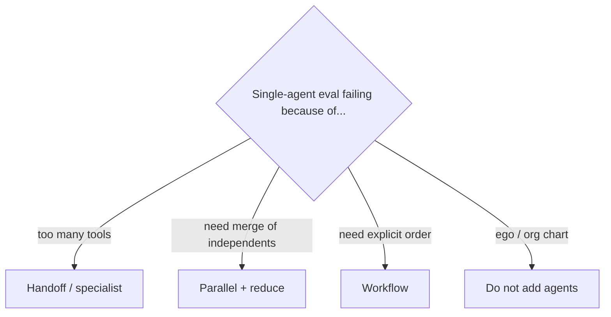

# Parallel vs hierarchy vs one agent

| Pattern | Use when | Avoid when |
|---|---|---|
| One agent | Tools < ~handful, one identity | You have not measured failures |
| Supervisor / workers | Fan-out with a merge policy | Workers share write locks |
| Handoff | Clear specialty + different policy | You lose the audit trail |
| Parallel | Independent read-only tasks | Writes race |
| Hierarchy | Nested budgets (manager → team) | Depth without eval |

Microsoft: multiple agents or functions coordinating → **workflow** is often the right box (`SRC-MS-AGENT-FRAMEWORK`).

