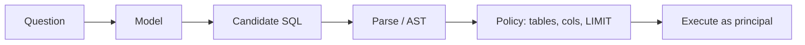

# NL-to-SQL

Level 1. The demo is “English in, table out.” The engineering is **never running unvalidated SQL**.

## What is it?

A model proposes a query; a **deterministic** layer must parse, authorize, and often rewrite before any cursor opens. Distinctive risks from the canonical architecture: injection, cartesian joins, PII columns ([reference-architecture.md](../00-MASTER-MAP/reference-architecture.md) Architecture C).

## Data / cloud analogy

You already forbid string-concat SQL in apps. An LLM is a very creative concatenator.

## When not to use NL-to-SQL

A parameterized API or semantic layer already answers the question. Prefer that.

## Wow demos

Forbidden until the reject path is tested. See [16-hands-on.md](16-hands-on.md).

## What should I learn next?

[When not to generate SQL](19-comparison.md) · [Arch C](../40-REFERENCE-ARCHITECTURES/C-nl2sql.md) · [Eval sheet](../50-CHEAT-SHEETS/eval.md)
