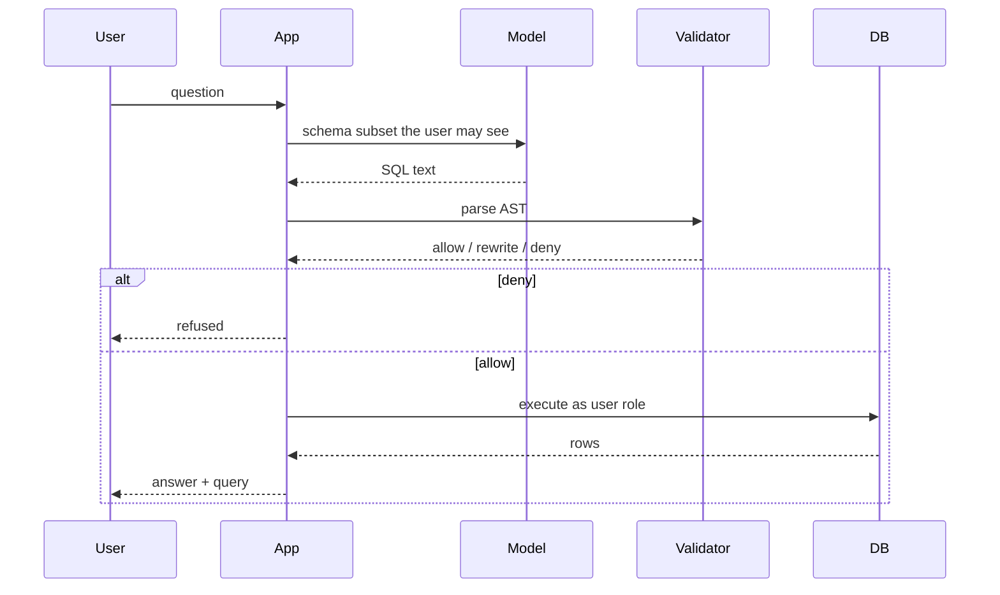

# Parse then permit (simple)

## Rules (durable)

1. Show the model only **allowed** tables/columns (do not prompt the whole warehouse).
2. Reject non-`SELECT` (or whatever your policy is) at AST, not by regex alone (regex loses).
3. Force `LIMIT`.
4. Run as the **caller’s** DB role, not a superuser.
5. Log the SQL; watch PII columns (`SRC-NIST-AI-600-1`).

Parser library choice is volatile — pick one and test it; do not invent an API here.

Improper output handling and injection sit in OWASP LLM Top 10 2026 (`SRC-OWASP-LLM-TOP10-2026`).
