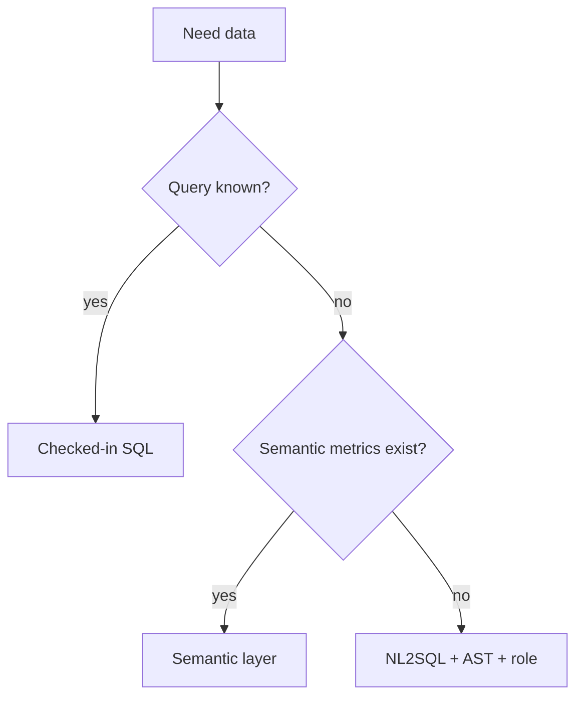

# When not to generate SQL

| Need | Prefer |
|---|---|
| Known report | Parameterized query / semantic layer |
| Single-row lookup by id | API |
| Write / DDL | Human + change management |
| Cross-tenant warehouse | Do not give the model a god role |

If the “agent” only ever emits one template, it is a function (`SRC-MS-AGENT-FRAMEWORK`).
