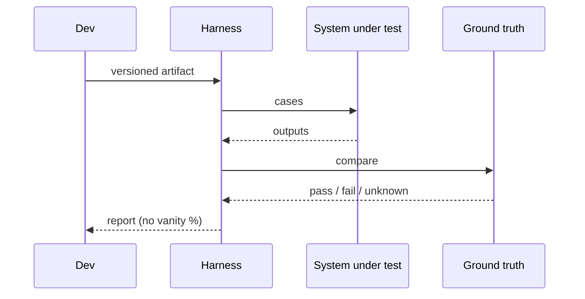

# Evaluation

Level 1. If you cannot fail a change, you are not shipping engineering — you are shipping a demo.

## What is it?

**Evaluation** is a repeatable way to decide whether a model, prompt, retriever, or agent is good enough for a defined task. NIST’s AI RMF is a voluntary framework to incorporate trustworthiness into design, development, use, and **evaluation** of AI systems (`SRC-NIST-AI-RMF-100-1`, `SRC-NIST-AI-RMF-LANDING`, fetched 2026-09-07). That is governance language, not a scorecard product.

## Data / cloud analogy

Data quality: you do not certify a warehouse because three analysts “liked the dashboard.” You have gold keys, constraints, and a job that fails the pipeline. LLM eval is that job for **behavior**.

## Why it exists

Confabulation and silent regressions (`SRC-NIST-AI-600-1`). Prompt edits and index refreshes change answers without compile errors.

## Ground truth first

Labeled cases you trust. An LLM-as-judge is a **helper** for cases that are expensive to label — [02-simple.md](02-simple.md). Official `openai/evals` is one framework/registry (`SRC-OPENAI-EVALS`); you do not need it to have a golden JSONL.

## What should I remember?

No gold, no ship. No invented accuracy numbers in this lab.

## What should I learn next?

[02-simple.md](02-simple.md) · [Eval pocket](../50-CHEAT-SHEETS/eval.md) · [Judge-as-truth](../47-ANTI-PATTERNS/01-overview.md)
