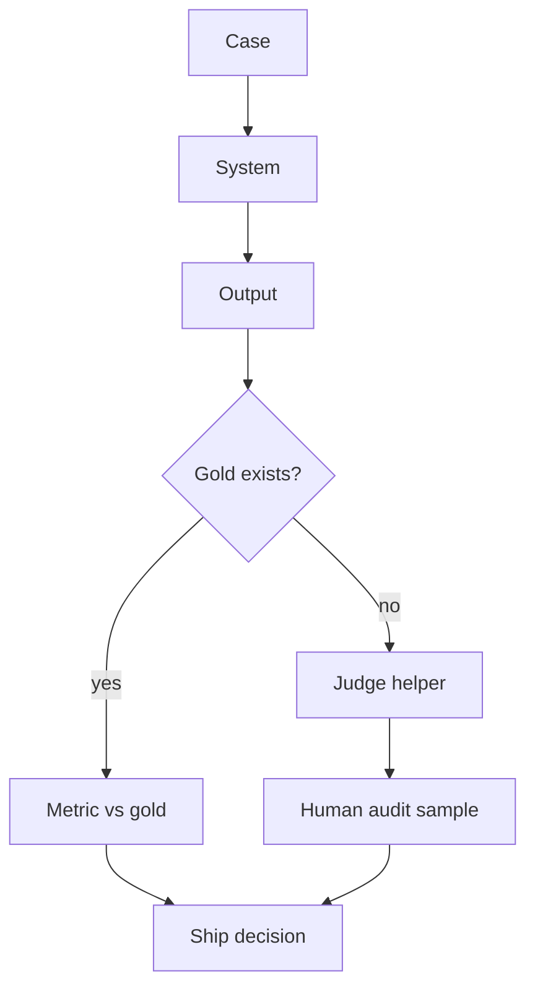

# Ground truth vs LLM-as-judge

| | Ground truth | LLM-as-judge |
|---|---|---|
| What it is | Human-agreed labels / gold SQL / gold chunk ids | Another model scores or ranks outputs |
| Role | **Source of truth** for the task | **Helper** when labels are scarce |
| Failure | Label error, stale gold | Judge shares the system’s biases; circular if judge ≈ system |
| Use | Classification, retrieve@k, exact extract | Rubrics for open prose — always sample-audited |

NIST generative-AI profile treats confabulation as a risk (`SRC-NIST-AI-600-1`). A judge model can confabulate a “pass.”

Do **not** report a judge score as production accuracy. Do not invent percentages here.

OpenAI Agents SDK mentions evaluation in the tracing/eval suite (`SRC-OPENAI-AGENTS-SDK`) — that is vendor tooling, not a substitute for gold.
