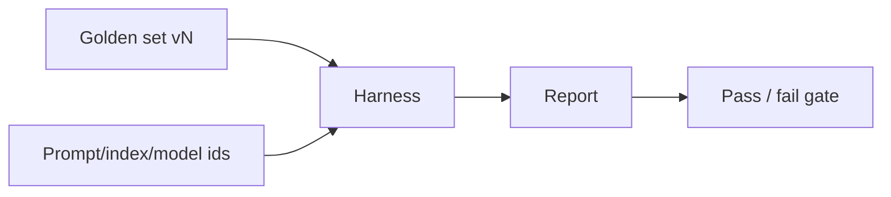

# Harness design

A **harness** is the job that runs cases against a pinned artifact and emits a report. `openai/evals` describes itself as a framework for evaluating LLM systems plus a registry of benchmarks (`SRC-OPENAI-EVALS`, fetched 2026-09-07). Registry formats are **not** taught from memory.

## Offline vs online

| | Offline | Online |
|---|---|---|
| Data | Frozen golden set | Live traffic / traces |
| Use | PR gate, nightly | Drift, canaries |
| Risk | Set goes stale | Privacy, selection bias |

## Toy vs production-oriented

| Toy | Production-oriented |
|---|---|
| Five chats in Slack | Versioned cases + artifact ids |
| One metric forever | Retrieve vs generate vs tool-success split |
| “Looks good” | Fail the build on gold regressions |
| Shared eval prompt in a notebook | Same harness in CI (`36` light note) |

## Dataset methodology (minimum)

Split: **train/dev must not leak into gold**. Record who labeled, when, and the policy. Measure **retrieve** separately from **generate** for RAG ([08](../08-RAG/02-simple.md)).

No fake leaderboard scores.
