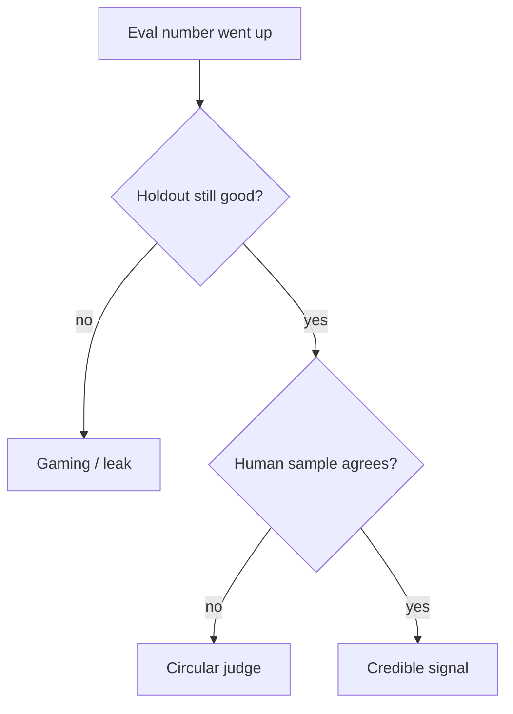

# How evaluation fails

| Failure | What happens | Control |
|---|---|---|
| Contamination | Gold items sat in the prompt, fine-tune, or few-shot | Hold out; hash cases; rotate |
| Circular judging | Judge model is the same family/prompt as the system | Gold for a slice; blind human audit |
| Metric gaming | Optimize the number, not the user | Multiple metrics; hidden holdout |
| Stale gold | Product changed, labels did not | Review cadence |
| Anecdote eval | Three chats decide a release | Harness or no ship ([19](19-comparison.md)) |
| Logging gold with PII | Eval store becomes a leak | Minimize; access control (`SRC-NIST-AI-600-1`) |

A rising score without a holdout is not evidence.
