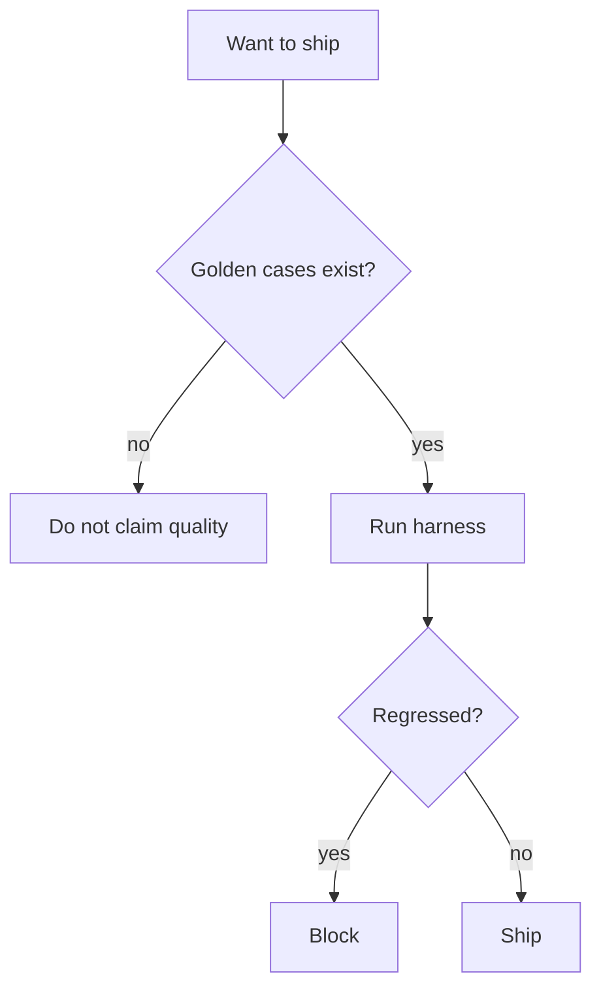

# When not to skip a harness

| Practice | Verdict |
|---|---|
| Look at a few chats, then ship | **Not eval** — exploration only |
| Ship with no gold and no judge audit | **Not a release** for anything user-facing |
| Judge-only score as “accuracy” | Helper abused as truth |
| Gold set + fail-the-build | Minimum for a structured app |
| Gold + retrieve@k + human sample | Minimum for RAG / agents |

NIST positions the AI RMF as helping organizations **evaluate** AI systems (`SRC-NIST-AI-RMF-LANDING`). Looking at Slack threads is not that.

## When a huge benchmark registry is the wrong first step

You have no task-specific gold. A public leaderboard will not tell you if *your* ACL filter works. Start with ten labeled cases.
