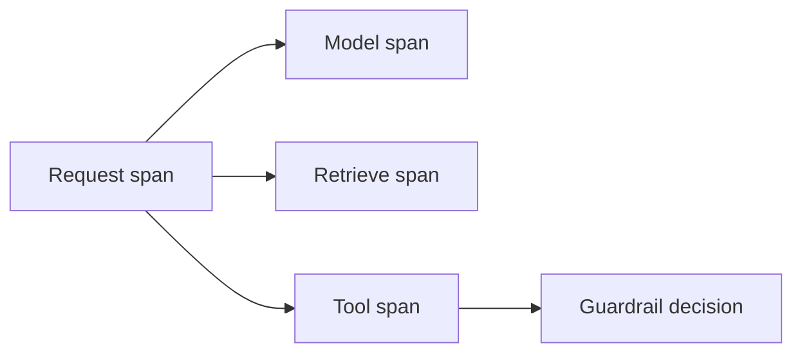

# Observability (methods, not fake SLOs)

You cannot operate what you cannot **trace without leaking**.

## What is it?

Spans for: inbound request, model call, retrieve, tool, guardrail decision, handoff. OpenTelemetry GenAI semantic conventions are **Development**, not Stable (`SRC-OTEL-GENAI-SEMCONV`, `SRC-OTEL-DOCUMENT-STATUS`). Do not pin a spec version from memory.

OTel guidance already recorded: do **not** capture instructions, inputs, or outputs by default — those attributes are opt-in (`SRC-OTEL-GENAI-SPANS`). PHI in a span is a DLP incident.

## What to measure (no invented numbers)

Presence of: trace id on user-visible errors, tool name + latency, retrieve hit/miss, tokens **if** your vendor bill uses them, guardrail block reason. Targets and p95s belong in **your** SLO doc after you measure — not in this lab.

AgentCore Observability emits OTel-compatible telemetry (`SRC-AWS-BEDROCK-AGENTCORE`). Foundry lists tracing + App Insights (`SRC-MS-FOUNDRY-AGENTS`). Same method, different sinks.

## When not

Debug dumps of full prompts in production. “We have CloudWatch” with no agent spans.

## What should I learn next?

[LLMOps](../20-LLMOPS/01-overview.md)
