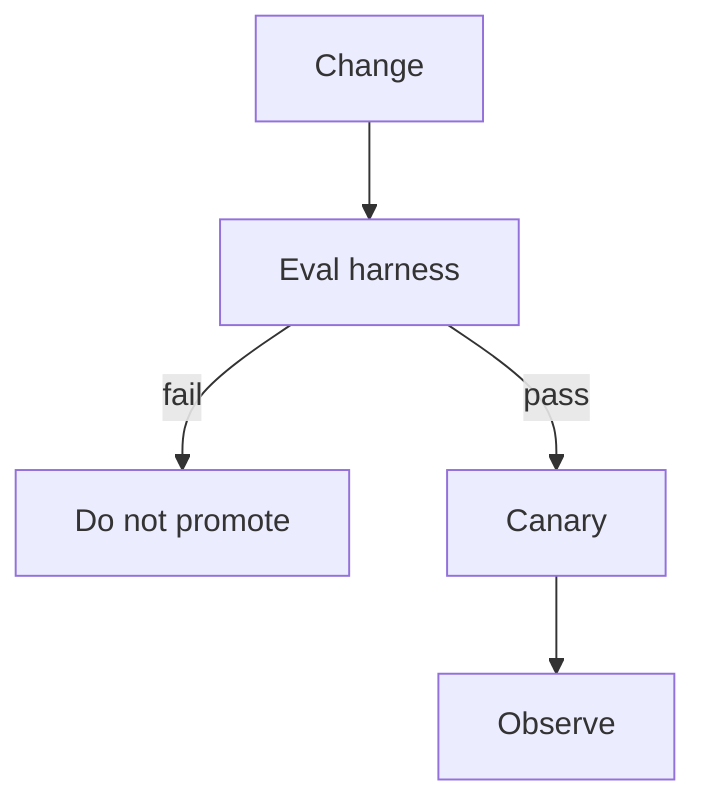

# LLMOps (release the behavior)

CI/CD for **prompts, indexes, tools, and models** — not only containers.

## What is it?

A change is a versioned artifact. The **harness** from Gate 5 is the unit test analog (`SRC-NIST-AI-RMF-LANDING` ties RMF to evaluation). No gold → no promote.

| Artifact | What “release” means |
|---|---|
| Prompt / agent config | Git + eval on gold |
| Index / ACL metadata | Rebuild + retrieve@k cases |
| Tool schema | Contract test + deny-by-default |
| Model id | Shadow or canary; never silent swap |
| Guardrail policy | Fail closed on parse error |

Foundry’s own lifecycle list is create → test → trace → evaluate → publish → monitor (`SRC-MS-FOUNDRY-AGENTS`). Portable version: **your** pipeline, not the portal.

## When not

Weekly prompt edits in a GUI with no version. “We’ll eval in prod.”

## What should I learn next?

[Cost](../38-AI-COST/01-overview.md) · [Performance](../37-AI-PERFORMANCE/01-overview.md)
