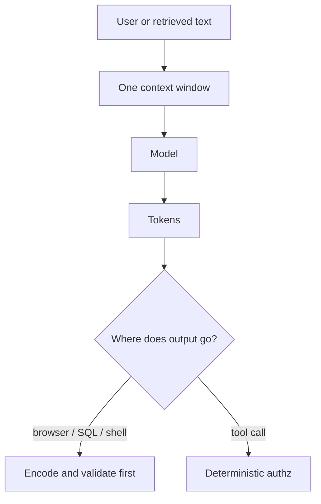

# AI security

Level 1. An LLM app is still an app: identity, least privilege, and output encoding. The new part is that **instructions and data share one token stream**.

## What is it?

**AI security** is how you keep an LLM, RAG index, or agent from becoming an attack path. The 2026 awareness list is the OWASP GenAI LLM Top 10 (`SRC-OWASP-LLM-TOP10-2026`, `SRC-OWASP-LLM-TOP10-2026-GH`). Canonical titles, verified from the project README on 2026-09-07:

| ID | Title |
|---|---|
| LLM01:2026 | Prompt Injection |
| LLM02:2026 | Sensitive Information Disclosure |
| LLM03:2026 | Excessive Agency |
| LLM04:2026 | Supply Chain |
| LLM05:2026 | Data and Model Poisoning |
| LLM06:2026 | Unbounded Consumption |
| LLM07:2026 | Misinformation |
| LLM08:2026 | Hidden Context Exposure |
| LLM09:2026 | Vector and Embedding Weaknesses |
| LLM10:2026 | Improper Output Handling |

Publication landing: 3 August 2026 (`SRC-OWASP-LLM-TOP10-2026`). GitHub README: **4 August 2026**. Same list; date disagrees by one day.

This list is **not** a CVE count and not a compliance certificate. It is a threat map.

## Data / cloud analogy

SQL injection + IAM + XSS, rewritten for a model that cannot tell a query from a comment. You already refuse to concatenate user text into SQL. Here you refuse to treat retrieved tickets, tool dumps, or “hidden” system prompts as a security boundary.

## Why it exists

NIST AI 600-1 treats prompt injection and data poisoning as **information-security** risks of generative AI, and names data privacy as a distinct risk (`SRC-NIST-AI-600-1`, PDF read 2026-09-07). The model is both a new attack surface and a new attacker assistant.

## What should I remember?

Assume the instruction boundary will be crossed. Design so a successful injection is **not** a successful exploit.

## What should I learn next?

[02-simple.md](02-simple.md) · [03-logical.md](03-logical.md) · [OWASP pocket](../50-CHEAT-SHEETS/security-top10.md)
