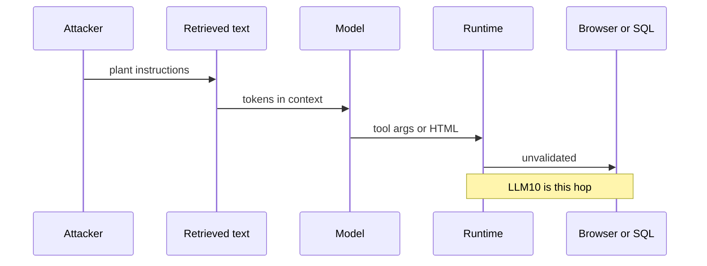

# Three OWASP doors that open together

Keep these three distinct. Official 2026 entries (`SRC-OWASP-LLM-TOP10-2026-GH`, files fetched 2026-09-07):

| Door | Official entry | What it is |
|---|---|---|
| Input | LLM01 Prompt Injection | Untrusted tokens change behavior. User text, RAG, tools, images, memory — same stream. |
| Privilege | LLM03 Excessive Agency | The model’s output can **do** too much (tools, shell, mail, MCP). |
| Egress | LLM10 Improper Output Handling | You treat model tokens as trusted input to HTML, SQL, shell, or Markdown renderers. |

LLM01’s own note: injection is the **input** boundary; LLM02 is **what leaks** in outputs; LLM03 is **privileged actions**; LLM10 is **sanitizing outputs before sinks**.

## Data / cloud analogy

A ticket system that lets anyone write the subject line (input), a service account with `*:*` (agency), and `innerHTML = response` (output). Fix any one and the incident shrinks; leave all three and you have a kill chain.

## Durable design rule (from LLM01)

OWASP states current models have **no reliable prevention** of injection because they do not separate instructions from data. Defense is architectural: least privilege, human confirmation for irreversible actions, schema checks in **your** code, not a second model as the only filter.

Do not paste paper attack-success percentages into a design review. Use the official list; measure **your** system.

## Hidden context is not a vault

LLM08 Hidden Context Exposure: system prompts, tool schemas, and “secret” policy text are **discoverable**. Do not put credentials there. Do not use the system prompt as authorization (`SRC-OWASP-LLM-TOP10-2026-GH`).

## What should I remember?

Injection without agency is often a bad answer. Agency without output handling is a remote tool. Together they are an incident.

## What should I learn next?

[03-logical.md](03-logical.md) · [Guardrails](../22-GUARDRAILS/01-overview.md)
