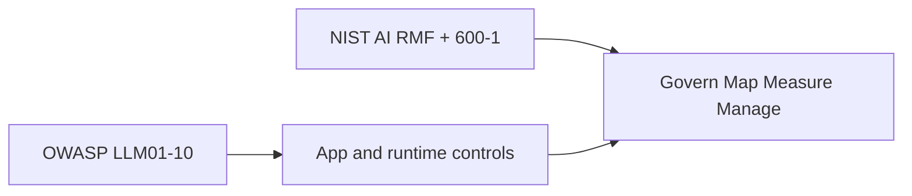

# OWASP LLM Top 10 2026 → lab controls

Titles are the official 2026 list (`SRC-OWASP-LLM-TOP10-2026-GH`). Control families are **this lab’s** mapping to existing nodes — not a new OWASP ID and not a vendor SKU.

| Official entry | Lab control family | First node to open |
|---|---|---|
| LLM01 Prompt Injection | Treat retrieved/tool text as hostile; least privilege; HITL for writes | [02-simple.md](02-simple.md) |
| LLM02 Sensitive Information Disclosure | Secrets out of prompts; DLP on ingress and egress | [23-PHI-PII-DLP](../23-PHI-PII-DLP/01-overview.md) |
| LLM03 Excessive Agency | Tool IAM, capability budget, no convenience `*:*` | [12-TOOLS-FUNCTION-CALLING](../12-TOOLS-FUNCTION-CALLING/01-overview.md) |
| LLM04 Supply Chain | Pin and audit MCP servers, models, packages | [13-MCP](../13-MCP/01-overview.md) |
| LLM05 Data and Model Poisoning | Ingest provenance; eval after corpus change | [18-EVALUATION](../18-EVALUATION/01-overview.md) |
| LLM06 Unbounded Consumption | Quotas, timeouts, max tool loops | Gate 7 cost/ops |
| LLM07 Misinformation | Gold cases; do not ship on vibes | [18-EVALUATION](../18-EVALUATION/02-simple.md) |
| LLM08 Hidden Context Exposure | No secrets in system prompt; prompt is not authz | [22-GUARDRAILS](../22-GUARDRAILS/01-overview.md) |
| LLM09 Vector and Embedding Weaknesses | ACL **inside** retrieve, not after; embeddings ≈ source data | [08-RAG](../08-RAG/19-comparison.md) |
| LLM10 Improper Output Handling | Encode for the sink; never `exec` model text | [15-NL2SQL](../15-NL2SQL/01-overview.md) |

## Vector layer (LLM09) without invented CVEs

Official description (fetched 2026-09-07): weaknesses in **embedding geometry and similarity search** — poisoning that makes retrieve wrong, inversion that leaks source text, jamming that makes retrieve silent, ACL that runs **after** a shared search. Distinct from LLM01 (instructions in retrieved text).

Permission-aware RAG you already have: filter **in the query**, not as a polite post-step.

## NIST companion, not a second Top 10

NIST AI 600-1 §2.9 names prompt injection and data poisoning under **information security**, and lists **data privacy** separately (`SRC-NIST-AI-600-1`). Use OWASP for app threats; use NIST for organizational risk functions ([24](../24-AI-GOVERNANCE/01-overview.md)).

## What a principal would challenge

“We passed an OWASP checklist” with no evidence of tenant-scoped retrieve, tool authz, or output encoding. The list does not expire those controls.

## What should I learn next?

[Guardrails](../22-GUARDRAILS/01-overview.md)
