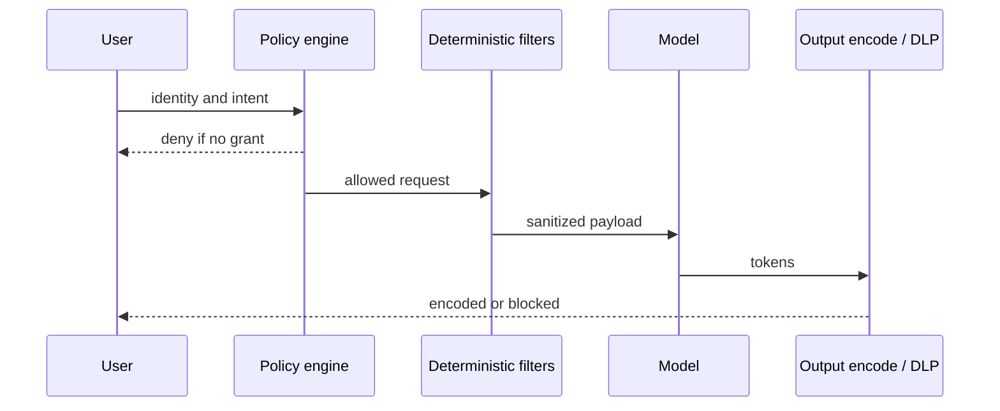

# Guardrails

A **guardrail** is a **policy** plus an **enforcer that is not the same model you are trying to constrain**.

## What is it?

Three layers, in this order:

1. **Policy** — written allow/deny: who may call which tool, which topics are out of scope, what may leave the tenant.
2. **Deterministic filters** — schema validation, allowlists, regex/NER DLP, IAM, rate limits, output encoding. They fail closed.
3. **Model-as-filter** — a classifier or “safety” LLM that scores text. Useful as a **hint**. It is still an LLM: injectable, stochastic, and evadable (LLM01).

OWASP LLM08: do not rely on hidden-context instructions as the primary control; enforce critical behavior **outside** the model (`SRC-OWASP-LLM-TOP10-2026-GH`). LLM01: validate outputs in **trusted application code**, not a second LLM call, if you need a structural guarantee.

## Data / cloud analogy

WAF + IAM + schema registry. You would not replace a network ACL with “ask the chatbot if this packet looks nice.”

## Vendor product ≠ definition

Amazon Bedrock Guardrails is one **vendor-specific** control plane: content filters, denied topics, word lists, sensitive-information filters (probabilistic PII plus custom regex), optional grounding checks (`SRC-AWS-BEDROCK-GUARDRAILS-OVERVIEW`, fetched 2026-09-07). You can associate a guardrail with a Bedrock agent (`SRC-AWS-BEDROCK-GUARDRAILS`). That does not make “Bedrock” the architecture. Portable design: policy + deterministic path first.

## When a model-as-filter is acceptable

Soft ranking, extra logging, language you have not written a recognizer for yet. Never as the only gate in front of a write tool, a payment, or PHI egress.

## What should I remember?

If the only lock is a prompt that says “never do X,” you do not have a guardrail. You have a hope.

## What should I learn next?

[19-comparison.md](19-comparison.md) · [DLP](../23-PHI-PII-DLP/01-overview.md)
