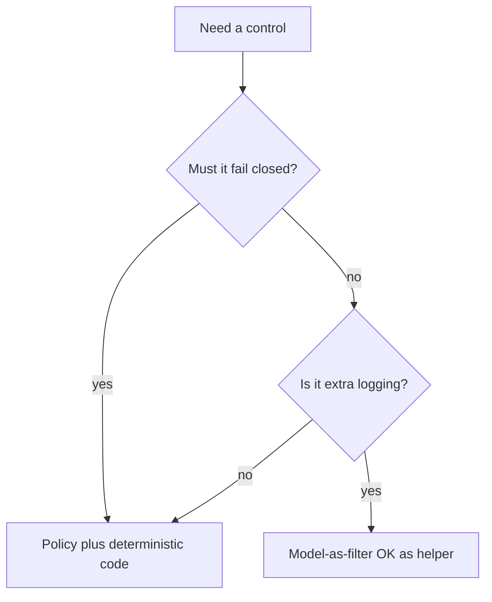

# When not to use the model as the filter

| Situation | Verdict |
|---|---|
| System prompt is the only deny list | **Not a guardrail** — LLM08 says hidden context is discoverable |
| Second LLM votes “safe” before a delete tool | **Not enough** — LLM01: no reliable injection prevention |
| Schema + IAM + HITL on irreversible actions | Minimum for write tools |
| Exact-match word list / regex / allowlisted tool args | Deterministic layer — keep it |
| Cloud “guardrails” product with no identity on tools | Vendor filter ≠ authorization |

## When not to buy a product first

You have no written policy and no tool IAM. A SKU will wrap the same hole.

## When not to skip HITL

OWASP LLM01: require explicit human confirmation before privileged, irreversible, or externally visible actions, and show the **exact** action, not a summary.

## What should I learn next?

[DLP](../23-PHI-PII-DLP/01-overview.md)
