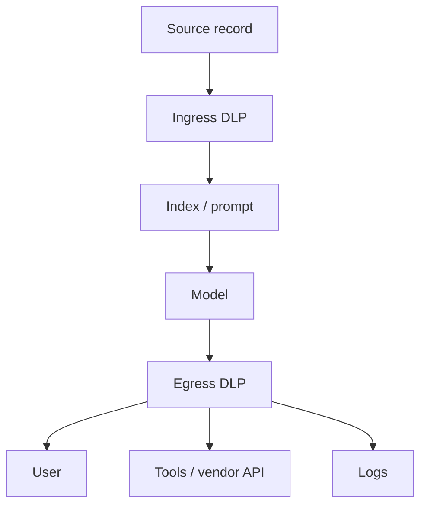

# PII, PHI, and DLP

**Data loss prevention** for LLM apps is egress and ingress control: what may enter the context window, and what may leave to a user, log, tool, or model vendor.

## What is it?

- **PII** — identifiers that point at a person (names, phones, account numbers). Sensitivity is **contextual** (NIST AI 600-1 §2.4).
- **PHI** — health information tied to a person. Same engineering problem, higher legal temperature. This lab uses **synthetic** records only.
- **DLP** — policy + detectors + **enforcement at a sink** (block, redact, refuse to call the tool).

NIST AI 600-1 names **data privacy** as a generative-AI risk: leakage, unauthorized use, de-anonymization, and inference of sensitive attributes even when the training set did not contain that fact (`SRC-NIST-AI-600-1`). OWASP LLM02 is the app-level sibling (sensitive information disclosure).

## Data / cloud analogy

Column-level security + tokenization + an egress proxy. You already do not `SELECT *` from a PHI table into a public dashboard. Do not `retrieve *` into a prompt either.

## LLM classifier is not enough

A model that says “this looks like PII” is another injectable, stochastic component (LLM01). It misses encodings, splits across fields, and anything outside its prompt. Pair it with:

- Deterministic recognizers (regex, checksums, NER) — e.g. Presidio Analyzer: regex + NER + custom recognizers (`SRC-PRESIDIO`, docs now at data-privacy-stack.github.io, fetched 2026-09-07).
- Network and IAM: the model never receives the raw column; tools never send raw PHI to an external endpoint.
- Purpose limitation: a summarizer does not need MRNs in the prompt.

Bedrock’s sensitive-information filter is one **vendor** mix of probabilistic PII plus custom regex (`SRC-AWS-BEDROCK-GUARDRAILS-OVERVIEW`). Useful, not a compliance program.

## What should I remember?

Redact at the **sink**. Detecting in a chat transcript after the vendor already stored the prompt is incident response, not DLP.

## What should I learn next?

[02-simple.md](02-simple.md) · [19-comparison.md](19-comparison.md)
