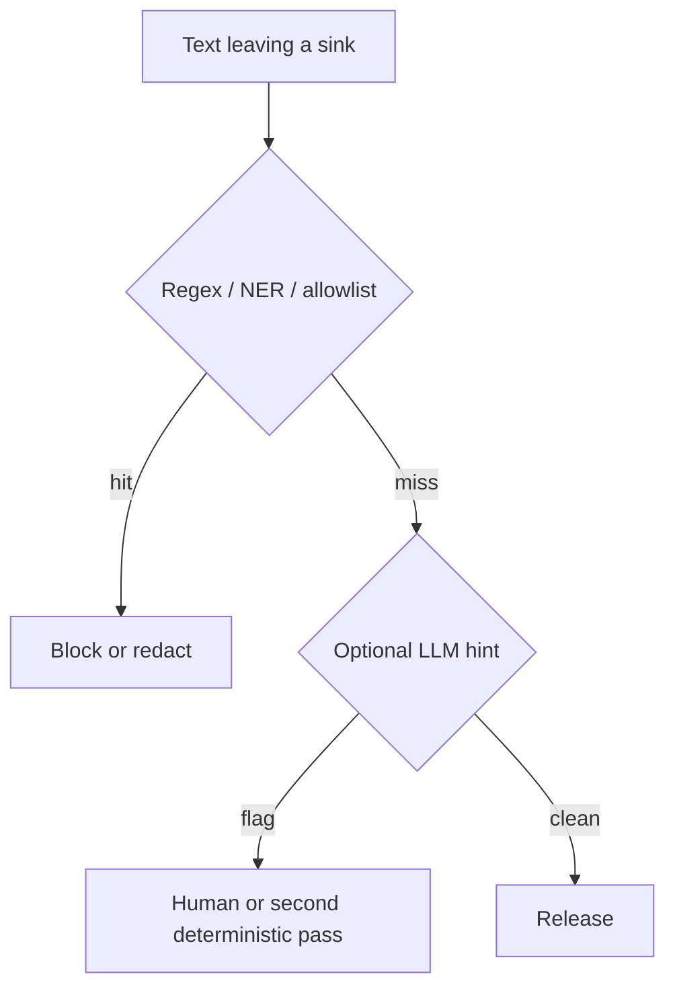

# When not to treat a classifier as DLP

| Practice | Verdict |
|---|---|
| LLM labels “PII / not PII” then you ship | **Not DLP** — helper only |
| Regex + NER + policy at each sink | Minimum engineering control |
| Vendor PII filter, no IAM on tools | Incomplete — egress still possible via tools |
| Embeddings of PHI in a shared index | Treat as source-data exposure (LLM09) |
| Gold-set of synthetic leaks in the harness | How you **evaluate** DLP |

Same pattern as evaluation: an LLM-as-judge is a helper; gold is truth ([18](../18-EVALUATION/02-simple.md)).

## When not to index

You cannot enforce row-level ACL on retrieve. Then do not embed the PHI corpus. Use a deterministic API that already knows the caller.

## What should I learn next?

[Governance](../24-AI-GOVERNANCE/01-overview.md)
