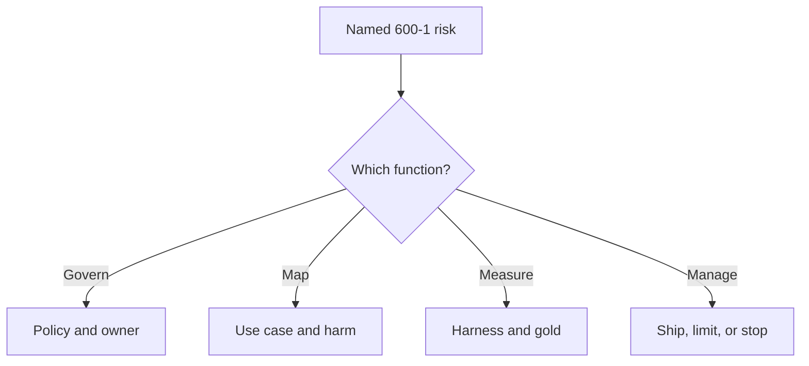

# Map this lab onto NIST — not a brochure

AI 600-1 is a **profile**: implement RMF functions for generative AI (`SRC-NIST-AI-600-1`). Action IDs in the PDF look like `GV-1.1-001`. This page does **not** reprint the catalog. It maps **functions and named GAI risks** to folders you already have.

## Functions → lab artifacts

| NIST function | Evidence in this lab | Not evidence |
|---|---|---|
| Govern | Written allow/deny, system inventory, incident notes | A vendor “AI governance” SKU name |
| Map | Intended use, when-not-agent, threat = OWASP 2026 | A logo slide of frameworks |
| Measure | Golden set + harness ([18](../18-EVALUATION/03-logical.md)) | Three Slack thumbs-up |
| Manage | Block-the-build, HITL, decommission path | “We will monitor in prod” with no owner |

## Named GAI risks in 600-1 §2 (PDF 2026-09-07)

Official labels only — do not invent extra ones:

1. CBRN Information or Capabilities  
2. Confabulation  
3. Dangerous, Violent, or Hateful Content  
4. Data Privacy  
5. Environmental Impacts  
6. Harmful Bias or Homogenization  
7. Human-AI Configuration  
8. Information Integrity  
9. Information Security  
10. Intellectual Property  
11. Obscene, Degrading, and/or Abusive Content  
12. Value Chain and Component Integration  

Security engineering in this gate primarily covers **information security** (injection, poisoning) and **data privacy**. Confabulation and information integrity sit with evaluation. Human-AI configuration and harmful bias sit with [responsible AI](../25-RESPONSIBLE-AI/01-overview.md). Value chain overlaps OWASP LLM04.

Playbook **subcategory step lists** are still **UNVERIFIED** here (not re-copied from the Measure playbook PDF).

## What a principal would challenge

A RACI chart with no Measure loop. NIST’s own landing page ties the framework to **evaluation** (`SRC-NIST-AI-RMF-LANDING`).

## What should I learn next?

[19-comparison.md](19-comparison.md)
