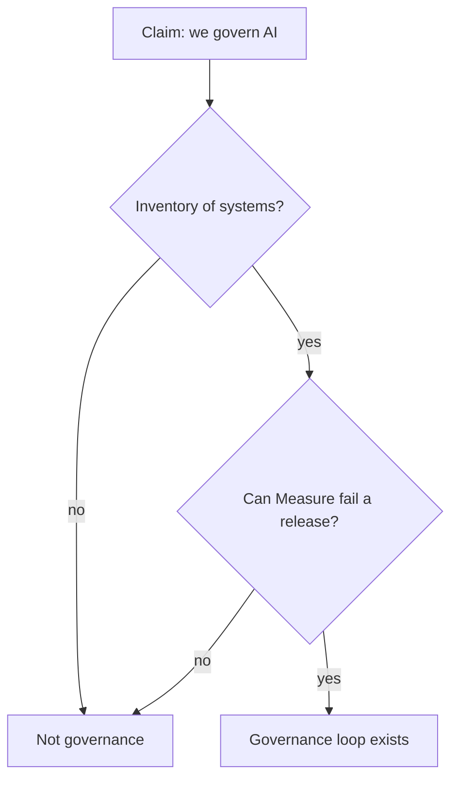

# When not to call it governance

| Artifact | Verdict |
|---|---|
| Framework logo collage | **Not governance** |
| Voluntary NIST RMF + named owners + eval evidence | Governance work |
| “Aligned with 600-1” and no inventory | Marketing |
| Policy that the model must enforce via prompt | Security theater (LLM08) |
| Board metric with no gold set | Not Measure |

NIST states the RMF is **voluntary** and aimed at trustworthiness in design, development, use, and evaluation (`SRC-NIST-AI-RMF-LANDING`). Voluntary does not mean optional evidence.

## When not to wait for the 1.0 revision

The landing page says 1.0 is being revised (2026-09-07). You can still Govern/Map/Measure/Manage **your** agent tomorrow. Do not freeze a procurement on unreleased text.

## What should I learn next?

[Responsible AI](../25-RESPONSIBLE-AI/01-overview.md)
