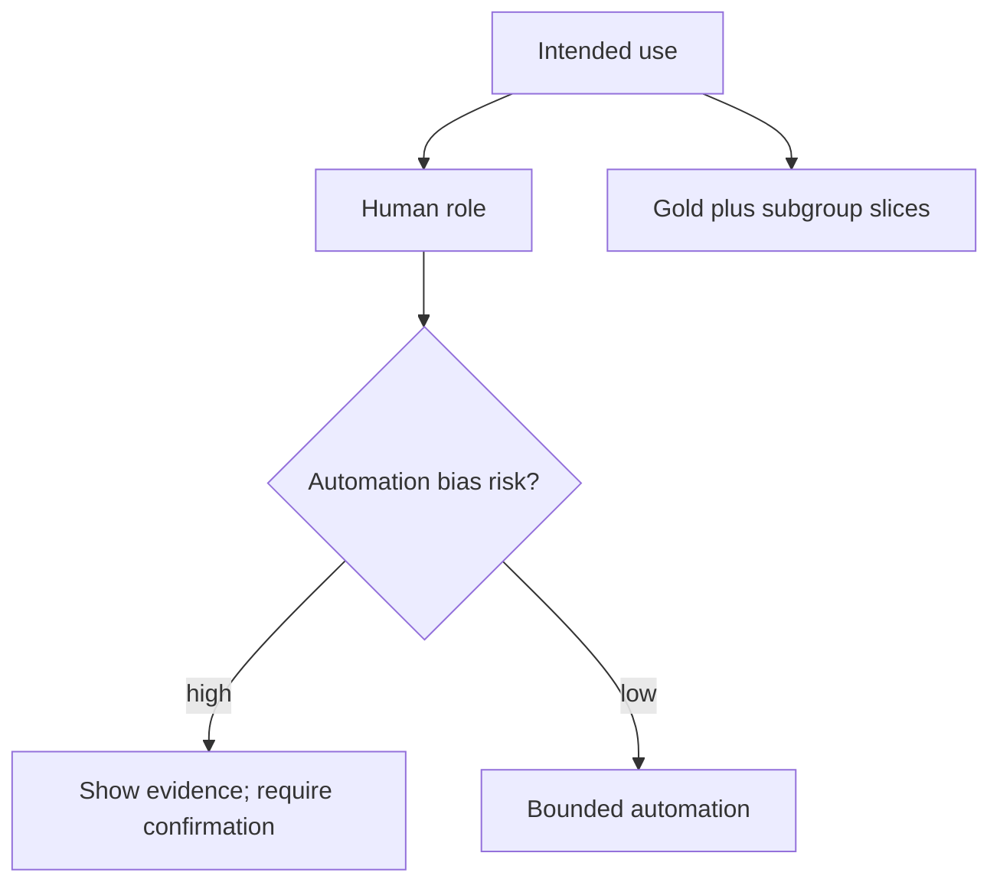

# Responsible AI

**Responsible AI** here means designing for NIST’s trustworthy characteristics — valid and reliable, safe, secure and resilient, accountable and transparent, explainable and interpretable, privacy-enhanced, fair with harmful bias managed — not a values poster.

## What is it?

AI 600-1 maps each named GAI risk to those characteristics (`SRC-NIST-AI-600-1`). Two risks that security pages under-cover:

- **Human-AI configuration** — automation bias, over-reliance, aversion, emotional entanglement. The human is in the loop in the wrong way, or not at all when they must be.
- **Harmful bias or homogenization** — subgroup failure, stereotyped generation, overly uniform outputs. This is an **eval and data** problem, not a filter SKU.

Confabulation is the same phenomenon Gate 5 already treats as “no gold, no ship.”

## Data / cloud analogy

Data quality + model monitoring + a human exception path. A “fairness dashboard” without a failed-build rule is a BI slide.

## What it is not

- A substitute for OWASP controls.
- A claim that your model is unbiased. Measure **your** slices; do not invent disparity percentages.
- Coverage of illegal content production (CSAM/NCII): AI 600-1 names that risk; this lab does not teach how to generate it. Policy is: do not.

## What should I remember?

Responsible AI without Measure is a press release. Security without Responsible AI still ships a system people over-trust.

## What should I learn next?

[19-comparison.md](19-comparison.md) · Gate 7 production (after this gate PASSes)
