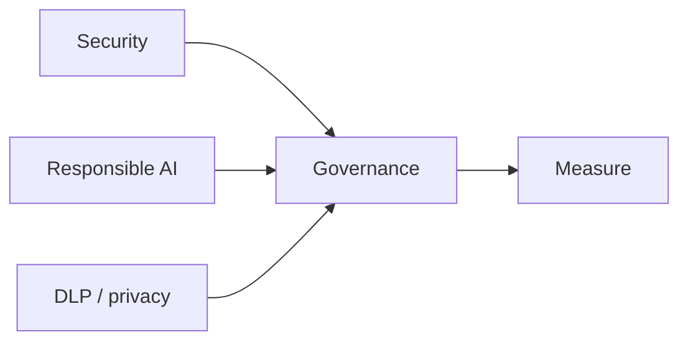

# When not to collapse the three words

| Word | Job | When it is the wrong tool |
|---|---|---|
| **Security** | Stop injection, agency, leaks, bad sinks (OWASP 2026) | “We red-teamed tone” |
| **Responsible AI** | Human-AI setup, bias/homogenization, over-trust | “We added a content filter, therefore fair” |
| **Compliance / DLP** | Legal basis, retention, PHI egress | “The model promised it would not store PII” |
| **Governance** | Owners + Measure + Manage (NIST RMF) | A brochure that lists all of the above |

## When not to use a chatbot as the ethicist

Consequential decisions (credit, care, employment) need mapped use, human accountability, and gold cases. NIST 600-1 §2.2 flags healthcare confabulation as a domain where confident error is operationally dangerous. Do not “ask the model if this is fair” as the control.

## What should I remember?

Three labels, three evidence piles. One slide that says “we take RAI seriously” is none of them.

## What should I learn next?

Back to [security map](../21-AI-SECURITY/03-logical.md) if a control is missing; otherwise wait for Gate 7 production architectures.
