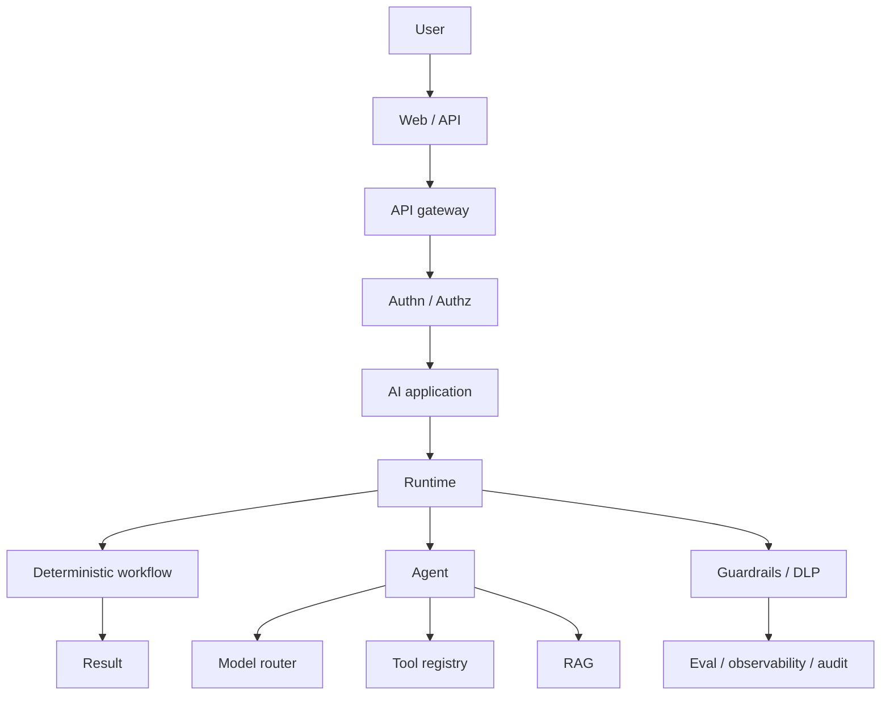

# Vendor-neutral production architecture

Level 1. Cloud pages are **mappings**. This page is the canonical stack. Do not start a design from a SKU list.

## What is it?

The same logical path already validated in Gate 1: user → API → **identity** → application → runtime (workflow **or** agent) → model router / tools / RAG → **guardrails / DLP** → eval / observability.

If steps are known, prefer a **workflow or function** (`SRC-MS-AGENT-FRAMEWORK`). An agent is optional.

## Cloud sketches (not BOMs)

| Concern | Neutral | Azure map | AWS map | Databricks map |
|---|---|---|---|---|
| Identity | OIDC + policy | Entra ID (`SRC-MS-FOUNDRY-AGENTS`) | IAM / IdP + AgentCore Identity (`SRC-AWS-BEDROCK-AGENTCORE`) | Unity Catalog + cloud IdP |
| Models | Router / gateway | Foundry model catalog / project endpoint | Bedrock + other FMs via AgentCore | Serving / gateway — confirm current Databricks name |
| Runtime | Self-host graph | Foundry prompt vs **hosted** agents — **not treated as GA** (`SRC-MS-HOSTED-AGENTS`) | Bedrock Agents **Classic** in maintenance; AgentCore for new work (`SRC-AWS-BEDROCK-AGENTS`) | Custom agents + **preview** managed MCP (`SRC-DATABRICKS-MCP`) |
| Retrieve | Hybrid + ACL in query | Azure AI Search / Foundry IQ — confirm SKU on Learn (`SRC-AZURE-AI-SEARCH-SKU`) | Bedrock Knowledge Bases | AI Search (formerly Vector Search) (`SRC-DATABRICKS-AI-SEARCH`) |
| Guardrails | Policy + deterministic | Content filters / Purview — confirm names | Bedrock Guardrails (`SRC-AWS-BEDROCK-GUARDRAILS-OVERVIEW`); AgentCore Policy | UC grants |
| Observe | OTel GenAI (**Development**) | App Insights + OTel | CloudWatch + OTel (`SRC-AWS-BEDROCK-AGENTCORE`) | Confirm MLflow tracing on current docs |

GCP is a **stub**, not a third column of fake parity ([29](../29-GCP-AI/01-overview.md)).

## What should I remember?

Map **concerns**. Do not copy a marketplace tile into the architecture diagram.

## What should I learn next?

[19-comparison.md](19-comparison.md) · [Azure map](../27-AZURE-AI/01-overview.md) · [Ref arch A–E](../40-REFERENCE-ARCHITECTURES/01-overview.md)
