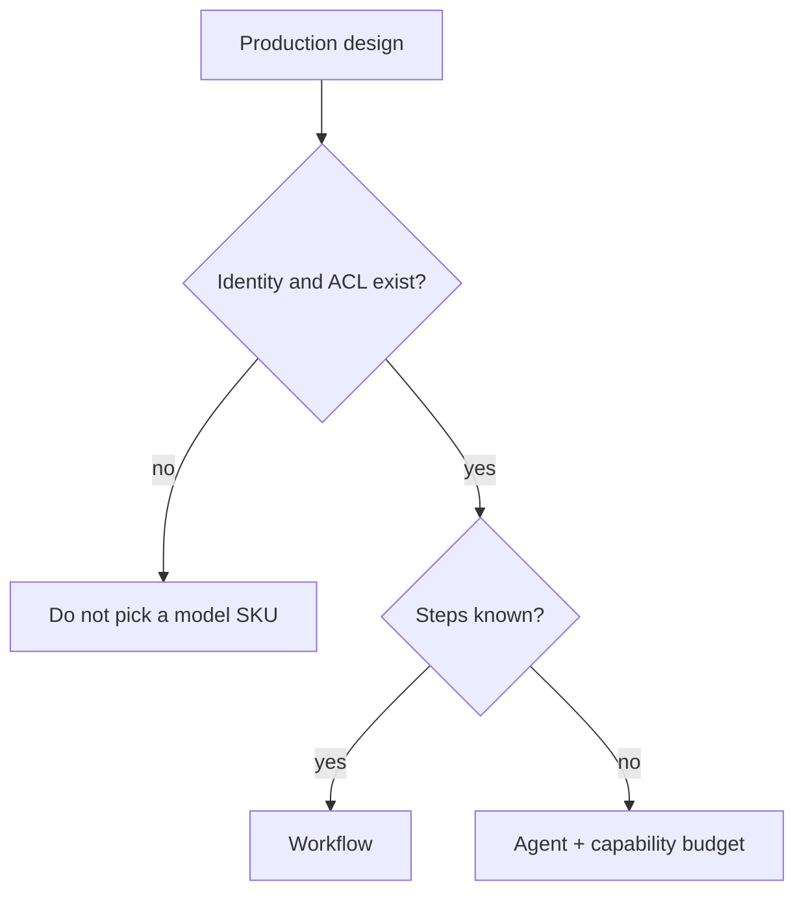

# When not to start from a SKU

| Urge | Verdict |
|---|---|
| “Pick Bedrock vs Foundry first” | **Too early** — identity, retrieve ACL, and eval first |
| Treat hosted / managed agents as the only runtime | Optional mapping; self-host a graph if you need portability |
| Price a design from memory | **UNVERIFIED** — official price page only |
| Agent for a stable 8-step job | Workflow / function (`SRC-MS-AGENT-FRAMEWORK`) |
| Full GCP/Azure/AWS feature matrix | Fake parity — map one concern at a time |

## What should I learn next?

[Reference architectures](../40-REFERENCE-ARCHITECTURES/01-overview.md)
