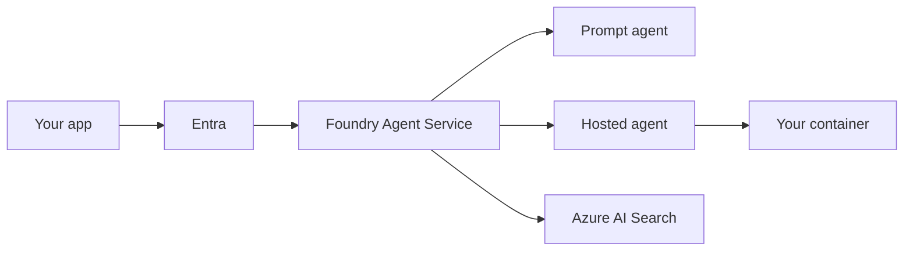

# Azure mapping (not a stack)

Sketch only. Names from Learn (`SRC-MS-FOUNDRY-WHAT-IS`, `SRC-MS-FOUNDRY-AGENTS`, fetched 2026-09-07): **Microsoft Foundry**, **Foundry Agent Service**. URL path stays `/azure/foundry/`. Previous brand: Azure AI Studio / Azure AI Foundry.

## Concern → family

| Neutral concern | Azure family (docs, not a BOM) |
|---|---|
| Identity | Microsoft Entra; per-agent identity on Agent Service (`SRC-MS-FOUNDRY-AGENTS`) |
| Prompt-only agent | **Prompt agents** — config, Foundry runs them |
| Bring-your-own code | **Hosted agents** — container or zip; Entra identity, scaling (`SRC-MS-HOSTED-AGENTS`) |
| Retrieve | Azure AI Search; Learn also mentions **Foundry IQ** as a knowledge layer on Search (`SRC-AZURE-AI-SEARCH-SKU`) |
| Observe | Tracing + Application Insights (same overview) |
| A2A | **A2A protocol (preview)** on the hosted-agents page |

## Hosted agents are not treated as GA

Re-fetched `SRC-MS-HOSTED-AGENTS` on 2026-09-07. The page **does not say generally available**. It no longer repeats the older “currently in preview” sentence in the converted HTML; **A2A is still labeled preview**. This lab **does not treat hosted agents as GA** (owner rule: remain preview unless Learn says GA).

Third-party frameworks and non-Foundry models remain **your** risk (`SRC-MS-HOSTED-AGENTS`).

## Search tiers — names only, no prices

Learn (`SRC-AZURE-AI-SEARCH-SKU`, fetched 2026-09-07): Dedicated (Free, Basic, Standard S1–S3 / S3 HD, Storage Optimized L1–L2) vs **Serverless (preview)** Developer. Dollar rates: verify [Azure AI Search pricing](https://azure.microsoft.com/pricing/details/search/) — **UNVERIFIED** here.

## What should I remember?

Mapping, not a recommendation to “do everything in Foundry.”

## What should I learn next?

[AWS map](../28-AWS-AI/01-overview.md) · [Architecture B](../40-REFERENCE-ARCHITECTURES/B-enterprise-agent.md)
