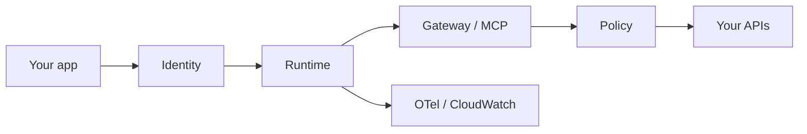

# AWS mapping (not a stack)

Two official surfaces, do not blur them.

## Bedrock Agents Classic

AWS docs (fetched 2026-09-07, `SRC-AWS-BEDROCK-AGENTS`): **Amazon Bedrock Agents (now Amazon Bedrock Agents Classic) is no longer open to new customers.** Existing customers continue; see Classic maintenance mode. Capabilities: action groups, optional Knowledge Bases, optional Guardrails (`SRC-AWS-BEDROCK-GUARDRAILS`).

Do not teach Classic as the default green-field path.

## AgentCore (new-work sketch)

`SRC-AWS-BEDROCK-AGENTCORE` (fetched 2026-09-07) describes **Amazon Bedrock AgentCore** as a platform of **modular** services you can use together or independently: Runtime, Memory, Gateway (MCP), Identity, Code Interpreter, Browser, Observability (OTel-compatible), Policy (deterministic tool intercept), Registry, Evaluations, and others.

This lab maps **concerns**, not the whole catalog:

| Neutral concern | AgentCore family (docs) |
|---|---|
| Run the agent | Runtime (session isolation, identity) |
| Tools as MCP | Gateway |
| Deterministic tool policy | Policy (Cedar / NL rules — confirm syntax on the page at implement time) |
| Identity | Identity (Cognito, Okta, Entra listed as examples) |
| Observe | Observability → OTel / CloudWatch |
| RAG | Still a retrieve design; Classic used Knowledge Bases — confirm current AgentCore retrieve path on AWS docs (**do not invent**) |

Pricing: AWS says consumption-based with no minimum; **verify** the official AgentCore price page. Dollar amounts **UNVERIFIED** here.

## Guardrails product ≠ architecture

Bedrock Guardrails remains a **vendor filter** (`SRC-AWS-BEDROCK-GUARDRAILS-OVERVIEW`). Pair with IAM and output encoding ([22](../22-GUARDRAILS/01-overview.md)).

## What should I remember?

Classic ≠ AgentCore. New designs start from concerns, then the current AWS page — not last year’s workshop deck.

## What should I learn next?

[Databricks map](../30-DATABRICKS-AI/01-overview.md)
