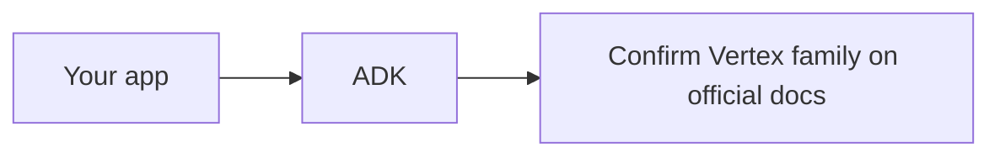

# GCP sketch (stub)

This gate does **not** invent a third full column next to Azure and AWS.

What we have sourced: **Agent Development Kit (ADK)** — official docs for building, evaluating, and deploying agents (`SRC-GOOGLE-ADK`, last verified 2026-09-07). Multi-language support is documented on that site; do not pin versions from memory.

Vertex AI product names, Agent Engine / Agent Platform marketing, and “Gemini Enterprise” labels are **volatile**. Confirm the current Google Cloud doc title before teaching a mapping.

| Neutral concern | This stub |
|---|---|
| Framework | ADK (`SRC-GOOGLE-ADK`) |
| Identity / retrieve / runtime SKUs | **UNVERIFIED** this gate — fetch Vertex docs at implement time |
| Feature parity with Foundry or AgentCore | **Do not assume** |

## What should I learn next?

Stay on the [canonical stack](../26-AI-CLOUD-ARCHITECTURE/01-overview.md) until a real GCP fetch lands.
