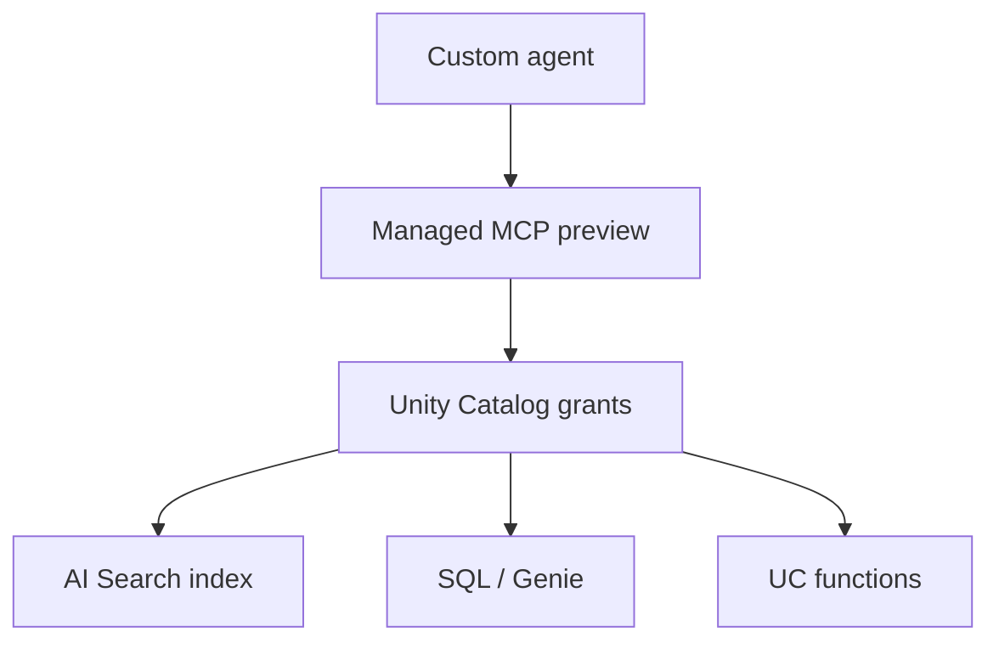

# Databricks mapping (not a stack)

Lakehouse-first sketch: **Unity Catalog** is the grant plane. Agents call **governed** tools; they do not replace UC.

## Managed MCP — Public Preview

Official page last updated 3 Sep 2026 (`SRC-DATABRICKS-MCP`, re-fetched 2026-09-07): managed MCP servers are **Public Preview**. Ready-made servers (docs table):

| Server | Use (docs) |
|---|---|
| Genie One / Genie Agent | NL analytics; Genie Ontology as semantic layer |
| AI Search | Unstructured retrieve |
| Databricks SQL | Queries you already wrote / pipeline authoring |
| UC functions | Predefined SQL as tools |

Docs prefer Genie for analytics over an agent writing SQL against raw tables — same “semantic layer first” rule as [NL-to-SQL](../15-NL2SQL/01-overview.md).

## AI Search (formerly Vector Search)

`SRC-DATABRICKS-AI-SEARCH` (fetched 2026-09-07): MCP retrieve over UC-governed indexes; `_meta` can pin hybrid vs ANN, filters, rerank columns. Old `vector-search` URL/scope still works. Also **Public Preview** on the page we fetched.

Querying an index **requires Databricks managed embeddings** (same page). Do not invent embedding model names.

## Pricing

Docs point at feature-specific price families (serverless compute, SQL, AI Search). **Verify** the official Databricks price pages. Dollars **UNVERIFIED**.

## What should I remember?

Preview ≠ production SLA. UC grants are the ACL story; MCP is a delivery pipe.

## What should I learn next?

[Architecture A](../40-REFERENCE-ARCHITECTURES/A-enterprise-rag.md) · [Architecture D](../40-REFERENCE-ARCHITECTURES/D-data-engineering-agent.md)
