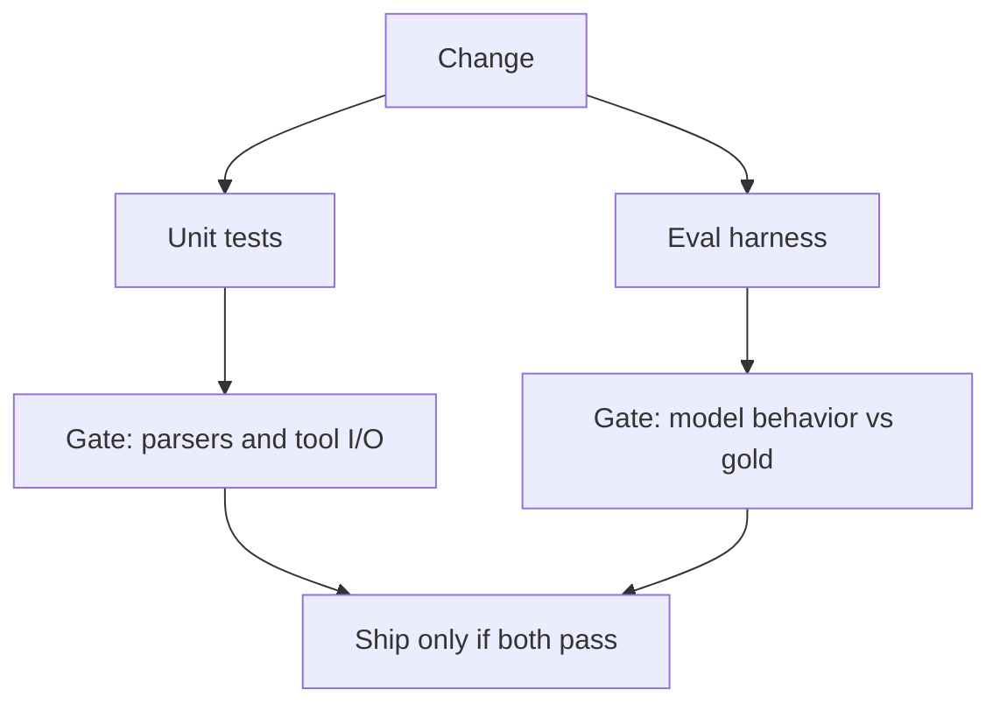

# Harness vs unit tests (Gate 5 light note)

Not the full testing domain.

| | Unit / contract tests | Eval harness |
|---|---|---|
| Asserts | Parsers, authz, AST refuse | Behavior vs gold |
| Determinism | High | Model may flake — pin seeds/models or allow retry policy |
| CI | Every commit | Every commit for **small gold**; nightly for large |

If you only have unit tests, you can still ship a fluent wrong answer. If you only have a harness, you can still ship `DROP TABLE` through an untested parser ([15](../15-NL2SQL/16-hands-on.md)).

Full test-strategy pages wait for later gates.

## What should I learn next?

[Eval pocket](../50-CHEAT-SHEETS/eval.md) · [How eval fails](../18-EVALUATION/14-failure-modes.md)
