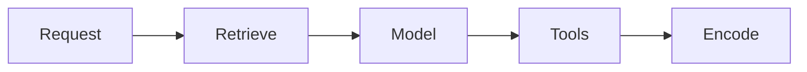

# Performance (methods, not fake latency)

No invented p95s. Measure **your** path.

## What to time

| Segment | Why it dominates |
|---|---|
| Time to first token | User-perceived chat |
| Retrieve + rerank | RAG (A) |
| Tool fan-out / serial tools | Agent (B) |
| SQL compile + warehouse | NL-to-SQL (C) |
| Cold start of a hosted container | Managed runtime — **preview/GA status is separate** |

Budgets are **design knobs**: max retrieved chunks, max tool hops, hybrid vs ANN (`SRC-DATABRICKS-AI-SEARCH` `_meta` can pin `num_results` / `HYBRID`). They are not SLOs until you measure.

## When not

Optimize the model SKU before you know if retrieve is 90% of the time. Quote a blog’s “200 ms RAG” as architecture truth.

## What should I learn next?

[Cost](../38-AI-COST/01-overview.md)
