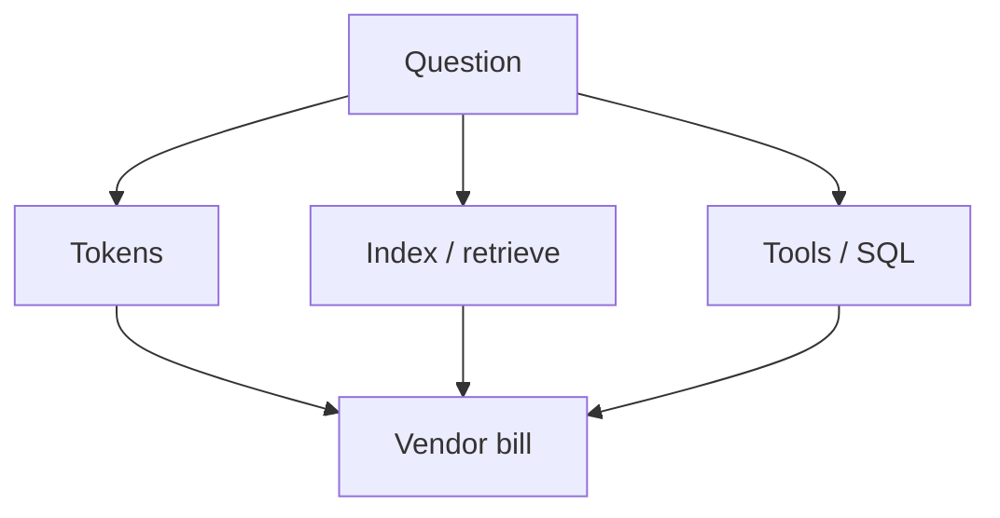

# Cost (drivers, not invented prices)

**Do not** copy dollar figures into this lab. Verify the official price page for the SKU you actually use.

## Drivers (durable)

| Driver | Shows up in |
|---|---|
| Tokens in / out (and cached, if the vendor bills it) | Every LLM call |
| Embedding + index storage | Architecture A |
| Tool / MCP / SQL compute | B, C, D |
| Idle provisioned search units vs serverless CU | Azure AI Search Dedicated vs Serverless preview (`SRC-AZURE-AI-SEARCH-SKU`) |
| Container compute on hosted agents | Foundry hosted cost model lists inference + tools + **container** (`SRC-MS-FOUNDRY-AGENTS`) |
| Agent loops | Unbounded consumption (OWASP LLM06) |

Official pages to **re-open** (do not memorize rates):

- Azure AI Search / Foundry IQ: https://azure.microsoft.com/pricing/details/search/
- AgentCore: AWS “AgentCore pricing” link from `SRC-AWS-BEDROCK-AGENTCORE`
- Databricks managed MCP: feature-specific pages listed on `SRC-DATABRICKS-MCP`

Rates on those pages are **UNVERIFIED** in this repo (not copied).

## When not

A slide with “$0.00 / 1K tokens” from a workshop. A design that cannot name the **unit** the vendor bills.

## What should I learn next?

[Ops](../39-AI-PRODUCTION-OPERATIONS/01-overview.md)
