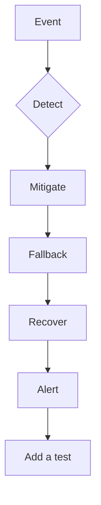

# Production operations (detect → fallback)

Same failure list as the canonical architecture. For each class: **detect, mitigate, fallback, recover, alert, test**. No invented MTTR.

| Failure | Detect | Fallback |
|---|---|---|
| LLM timeout / unavailable | Span error, budget | Cached safe reply or “try later”; do not retry forever |
| Search / DB down | Dependency check | Degrade to keyword or refuse |
| Wrong tool / loop | Hop counter, eval | Cut loop; HITL |
| Prompt injection | Policy + logs | Least privilege already on (LLM01/03) |
| Bad retrieve / stale index | Gold retrieve@k, freshness job | Refuse rather than guess |
| Bad SQL | Validator reject | No execute |
| PII/PHI leak | Egress DLP | Block + incident |
| Token / cost explosion | Quotas (LLM06) | Kill switch |
| Model regression | Harness on release | Rollback model id |
| Index corruption | Checksum / canary query | Prior replica |

## When not

Pager on every model hesitation. “The agent will self-heal” with write tools.

## What should I learn next?

Back to [A–E](../40-REFERENCE-ARCHITECTURES/01-overview.md). Hands-on is Gate 8.
