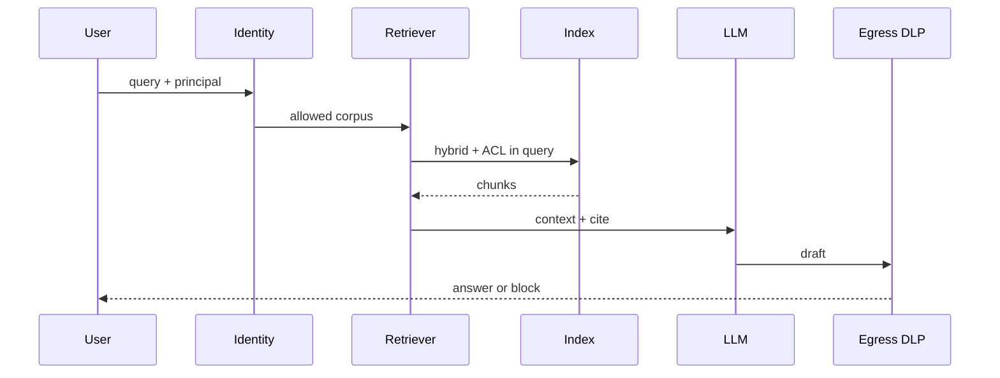

# A — Enterprise RAG

Question → retrieve **as the caller** → generate with citations → DLP. Distinctive risks: **ACL leakage through chunks** and **stale indexes** (Gate 0). OWASP LLM09: filter **in** the similarity query, not after (`SRC-OWASP-LLM-TOP10-2026-GH`).

## Sequence

Toy: PDF → embed → top-K → LLM. Production-oriented adds parse, malware scan, ACL metadata, hybrid retrieve, citation, eval on gold questions ([08](../08-RAG/19-comparison.md)).

## When not architecture A

| Situation | Prefer |
|---|---|
| One known document, one template | Workflow + SQL/API |
| Caller cannot be bound to row/chunk ACL | Do not index that corpus |
| Retrieve is already wrong | Fix index / hybrid before an agent ([09](../09-AGENTIC-RAG/01-overview.md)) |

## Failure-first (this shape)

Stale index → freshness SLO + rebuild job. Cross-tenant hit → treat as incident (LLM09). Empty retrieve → refuse to answer, do not confabulate.

## What should I learn next?

[B](B-enterprise-agent.md)
