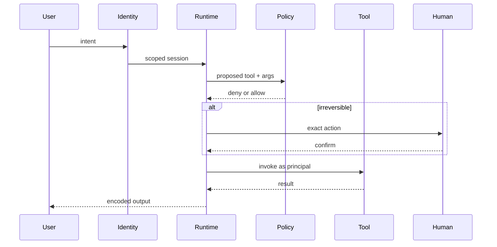

# B — Enterprise AI agent

A loop that **may** call tools. Distinctive risks: **excessive agency** and **tool blast radius** (OWASP LLM03). Identity is on the **runtime**, not in the system prompt (LLM08).

## Sequence

Managed runtimes are **optional mappings** ([27](../27-AZURE-AI/01-overview.md), [28](../28-AWS-AI/01-overview.md)). Hosted agents are **not treated as GA**.

## When not architecture B

| Situation | Prefer |
|---|---|
| Steps are enumerated | Workflow (`SRC-MS-AGENT-FRAMEWORK`) |
| One extract / classify | Structured LLM app |
| Read-only FAQ over a corpus | Architecture A |
| Write tool with `*:*` | Do not ship |

## Failure-first

Wrong tool / loop → max steps + eval. Injection in tool output → treat tool text as LLM01. Cost explosion → quotas ([38](../38-AI-COST/01-overview.md)).

## What should I learn next?

[C](C-nl2sql.md)
