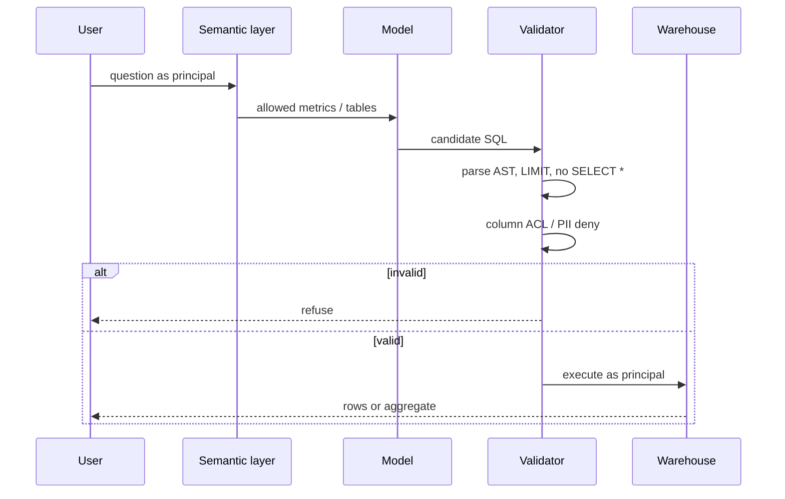

# C — Agentic NL-to-SQL

English in, **validated** SQL out. Distinctive risks: **injection**, **cartesian joins**, **PII columns**. The model never gets a raw cursor.

## Sequence

Databricks docs prefer Genie / ontology over freehand SQL against raw tables (`SRC-DATABRICKS-MCP`). Same idea: **semantic layer first**.

## When not architecture C

| Situation | Prefer |
|---|---|
| Repeated dashboard question | BI / scheduled SQL |
| Parameterized API already exists | Call the API |
| No column ACL | Do not expose the warehouse |
| “Wow demo” with `EXECUTE` on model text | Never |

## Failure-first

Cartesian / fan-out → cost and warehouse kill. PII column in SELECT → DLP + schema deny. Injection via comment/union → AST allowlist only.

## What should I learn next?

[D](D-data-engineering-agent.md) · [15](../15-NL2SQL/01-overview.md)
