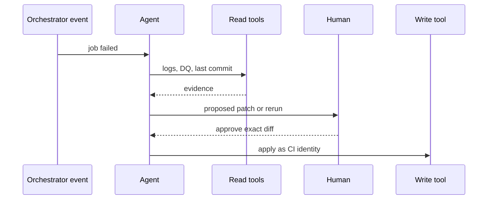

# D — Data engineering agent

An agent that **looks at** pipelines (logs, DQ, lineage) and, only if you are reckless, **writes** them. Distinctive risk: **write tools against pipelines** (drop table, overwrite job, widen grant).

## Sequence

Default: **read + propose**. Writes go through the same PR/CI path a human uses. UC functions / SQL MCP are still tools with blast radius ([30](../30-DATABRICKS-AI/01-overview.md)).

## When not architecture D

| Situation | Prefer |
|---|---|
| Test is already a dbt / GE assertion | Run the test |
| Pager rule is a threshold | Alert, no LLM |
| Agent can `DROP` / `ALTER` prod | Remove the tool |
| Unreviewed overwrite of a streaming job | HITL + dry-run |

## Failure-first

Wrong table in a write → backups and blast-radius IAM. Looping retries → max attempts. Prompt injection in a ticket title → LLM01 on the read surface.

## What should I learn next?

[E](E-multi-agent.md)
