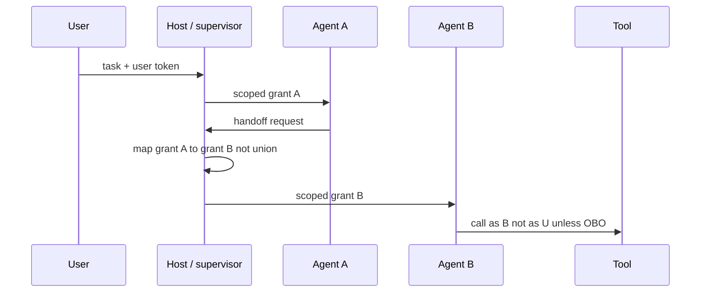

# E — Secure multi-agent platform

Several agents, one **trust story**. Distinctive risks: **confused deputy** (agent B acts with agent A’s privileges) and **A2A trust** (who may call whom).

Foundry documents **A2A protocol (preview)** (`SRC-MS-HOSTED-AGENTS`, `SRC-MS-FOUNDRY-AGENTS`). Treat A2A as volatile. MCP still has host / client / server — the **host** owns authz ([13](../13-MCP/01-overview.md)).

## Sequence

## When not architecture E

| Situation | Prefer |
|---|---|
| One loop is enough | Architecture B |
| Coordination is a fixed DAG | Workflow of functions / agents on rails |
| You cannot name the deputy | Do not add A2A |
| Shared service account for all agents | Do not ship |

## Failure-first

Confused deputy → per-agent identity, no grant union. Poisoned handoff text → treat as LLM01. Unreadable traces → do not add a third agent ([14](../14-MULTI-AGENT-SYSTEMS/01-overview.md)).

## What should I learn next?

[Observability](../19-OBSERVABILITY/01-overview.md) · [Ops](../39-AI-PRODUCTION-OPERATIONS/01-overview.md)
