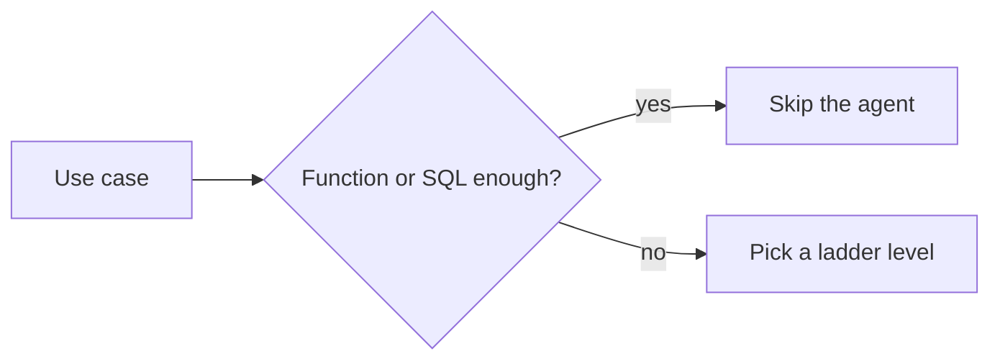

# Fifteen use cases (not fifteen platforms)

Pointers from Gate 0. **Do not** build these as products this gate. Each row says which **ladder level** exercises the hard part, and when a **deterministic** path wins.

| Use case | Ladder | Deterministic might win |
|---|---|---|
| Enterprise knowledge assistant | L3 | Search + workflow |
| Healthcare knowledge assistant | L3 + L8 | Form + human review; PHI |
| Customer support agent | L4 + L8 | Refund playbook |
| Data analyst agent | L6 | BI dashboard |
| NL-to-SQL analyst | L6 | Semantic layer / API |
| Data quality agent | L10 checklist | dbt / GE tests |
| Pipeline monitoring agent | L9 | Threshold pager |
| Incident management agent | L4 read-only | Runbook |
| Documentation agent | L2 | Docs search |
| Software engineering agent | L8 | Sandbox + CI (no secrets) |
| Cloud operations agent | L8 | Approved runbook |
| Security investigation agent | L8 + L9 | SIEM query, not a confident chatbot |
| Financial reporting agent | L6 | Deterministic aggregates |
| Marketing analytics agent | L3 DLP | Warehouse metrics |
| Enterprise research agent | L2 + L5 | Citations + freshness |

Full outlines remain in [projects.md](../00-MASTER-MAP/projects.md). Implementations: [42](../42-CAPSTONE-PROJECTS/01-overview.md).

**Recent (2026) assignments people actually published:** [Recent challenging agentic assignments](recent-agentic-assignments.md) — Duolingo platform, Mobileye support, KTern SAP fleet, Microsoft claw harness, current coding-agent benches. Publisher metrics stay UNVERIFIED.

## What should I learn next?

[Ladder](../42-CAPSTONE-PROJECTS/01-overview.md) · [Architect interviews](../44-ARCHITECTURE-INTERVIEWS/01-overview.md)
