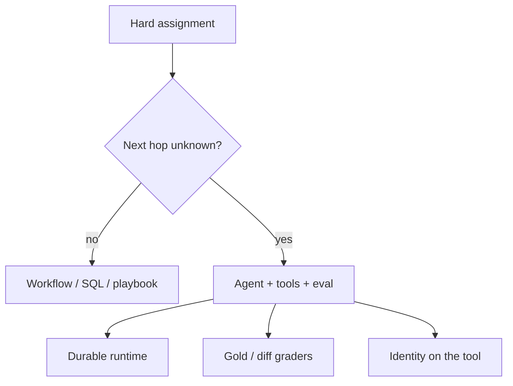

# Recent challenging agentic assignments (mid–2026)

Reference list for **you to read**, not a claim that this lab reproduced the systems. Window: roughly **June–September 2026**, plus the current official coding-agent evals those posts sit on.

**Rules on this page**

- Only **fetched** company or cloud blogs, or official lab posts.
- Outcome percentages are **publisher-reported**. Independently **UNVERIFIED**. Do not paste them into a slide as lab-measured truth.
- No invented “Netflix / Uber internally does X.” If there is no URL, it is not here.
- A hard assignment is still often a **workflow** with an LLM node. Microsoft’s function-over-agent rule still applies (`SRC-MS-AGENT-FRAMEWORK`).

## Production assignments (what teams actually shipped)

| When | Who published | The hard assignment | Why it is agentic (not a chat UI) | What they say they used | Source |
|---|---|---|---|---|---|
| 2026-08-04 | Duolingo engineering | Shared **agent platform**: define once (prompt, MCPs, repos), run from Slack / CLI / site / other workflows. Agents that **fix CI**, address review comments, and a **release-manager Slack bot** (crash investigate → relevant diffs → summary). | Minutes-long runs, tool calls, human wait, retries. Eval grades **git diffs**, not prose. | Temporal `AgentWorkflow`; MCP; Claude Agents SDK + Codex CLI + OpenAI Agents SDK; deterministic graders + optional judge | `SRC-DUOLINGO-AGENT-PLATFORM` |
| 2026-08-05 | AWS + Mobileye | **Drive-data support agent**: tickets about thousands of daily drive-recording sessions. Was “15 clicks / many systems.” Agent classifies, queries live pipeline via **MCP**, writes a ticket reply. | Context varies; static scripts failed. Hybrid: **on-prem ticket bus** + cloud runtime (tickets not reachable from AWS). | Amazon Bedrock AgentCore Runtime + Observability; Secrets Manager; internal LLM gateway to Claude on Bedrock | `SRC-AWS-MOBILEYE-AGENTCORE` |
| 2026 (AWS ML blog, fetched 2026-09-07) | AWS + KTern.AI | **SAP S/4HANA transformation fleet**: reverse-engineer custom ABAP, fit-to-standard, code analysis, test-case generation, process/exception mining. They describe **20+** specialized agents, months-long project memory. | Long-horizon context, SAP APIs, multi-tenant isolation, consultant-scale analysis. | AgentCore runtime / memory / gateway (MCP) / identity / observability / evaluations; Strands swarm / workflow / graph | `SRC-AWS-KTERN-AGENTCORE` |
| 2026-08-27 | Microsoft Agent Framework | **“Claw” finance assistant** taken from one tool to a **production harness**: one agent factory, three hosts (console, hosted, eval CI). | Same agent must run interactively, hosted, and in evals. Governance + traces without rewriting the loop. | OpenTelemetry traces; Microsoft Purview screening (they frame a regulated-finance context); Foundry Hosted Agent; local + hosted evals | `SRC-MS-AGENT-HARNESS-CLAW` |
| 2026-09-03 | AWS | **Migrate an existing agent** onto AgentCore in stages: Runtime + Gateway + Memory first (graph unchanged), then optional model-driven loop / harness. | The hard part they name is **shedding infra** (compute, tool auth, checkpoints) without losing the reasoning graph. | AgentCore Runtime, Gateway, Memory; optional Strands / harness | `SRC-AWS-AGENTCORE-MIGRATE` |

Publisher-reported outcomes (do not treat as this lab’s measurements):

- Duolingo: new agent “about 10 minutes” vs “several weeks” of per-team infra (`SRC-DUOLINGO-AGENT-PLATFORM`).
- Mobileye / AWS: 66% of tickets were routine status; they report ~1 minute replies, 98% success vs a 95% PoC target, 90% response-time cut (`SRC-AWS-MOBILEYE-AGENTCORE`).
- KTern.AI / AWS: they report 45% shorter SAP timelines, 60–70% less discovery time, 90% of named Finance/Sales exceptions surfaced, 82% first-pass generated tests, 480 eng hours/month reclaimed (`SRC-AWS-KTERN-AGENTCORE`). All **UNVERIFIED** here.

## Frontier *assignments* (benchmarks, not your production)

These are the **hard tasks labs score agents on** in 2026. Harness and contamination matter more than a single percentage.

| Assignment | What the agent must do | Official note | Source |
|---|---|---|---|
| **SWE-bench / SWE-Bench Pro** | Resolve real GitHub-style issues: implement a change that passes new tests without breaking old ones. | OpenAI later **retracted** recommending SWE-Bench Pro after contamination / design issues (`SRC-OPENAI-SWE-EVALS` — page fetch **timed out** 2026-09-07; title/URL from search — treat details **UNVERIFIED** until re-fetched). | `SRC-OPENAI-GPT-55`, `SRC-OPENAI-SWE-EVALS` |
| **Terminal-Bench 2.x** | Multi-step CLI: plan, iterate, coordinate tools. | Anthropic documents Terminus-2 harness, resource caps, and that scores are not always comparable across labs (`SRC-ANTHROPIC-OPUS-47`). | `SRC-ANTHROPIC-OPUS-47` |
| **Long-horizon / Expert-SWE style** | Hours-scale implementation, not a one-shot patch. | OpenAI describes Expert-SWE as an *internal* eval (median human time they state: 20 hours). Internal = not a public gold set you can copy. | `SRC-OPENAI-GPT-55` |
| **MCP / tool-using office work** | MCP-Atlas, finance/legal agent benches, computer-use. | Anthropic system cards list these as capability evals, not your SLA. | `SRC-ANTHROPIC-OPUS-47` |

Do **not** bake GPT / Claude leaderboard numbers into architecture reviews. They move with harness, effort level, and contamination screens.

## What is actually hard (durable)

| Hard part | Seen in | Durable control |
|---|---|---|
| Minutes-to-months runtime | Duolingo Temporal; KTern 12–18 month SAP memory | Durable workflow / checkpointed memory |
| Tools that mutate the world | CI fix + git diff; SAP write paths | Identity on the tool; eval the **diff**, not the essay |
| Hybrid networks | Mobileye on-prem tickets | Principal and secrets stay off the model |
| Eval that lies | SWE-bench contamination | Gold + deterministic graders; judge is optional (`SRC-DUOLINGO-AGENT-PLATFORM`) |
| Platform vs one agent | Duolingo registry; Mobileye `agentcore deploy` | Definition ≠ runtime |

## When these are still the wrong pattern

| Assignment looks agentic | Prefer |
|---|---|
| Ticket is “what is session X status?” and the API is stable | Workflow + MCP read + template |
| SAP “exception” is a known FI match rule | Job + allow-listed query |
| Finance claw can be a form + Purview + human | Workflow (`SRC-MS-AGENT-FRAMEWORK`) |

## Architect challenge

Pick **one** row. Draw: caller → durable runtime → tools → eval artifact (ticket text, git diff, SAP object). Mark where a **human** must approve a write. If you cannot name the artifact you grade, you do not have an assignment — you have a demo.

## What should I remember?

Recent hard work is **platform + eval + identity**, not a new model name.

## What should I learn next?

[Use-case map](01-overview.md) · [Agents Complex](../10-AGENTS/15-real-world-example.md) · [Sources catalog](../00-MASTER-MAP/sources-and-reading.md)
