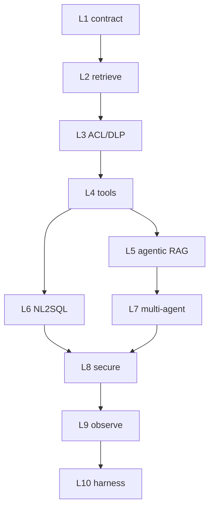

# Hands-on ladder L1–L10

Lab quality, not fifteen platforms. Each level **proves one claim**. Python under `labs/` uses **stubs and synthetic data** — no API keys, no real PII. SDK method names stay **UNVERIFIED** until you fetch the vendor page.

Run from the repo root (Windows PowerShell):

```text
python 42-CAPSTONE-PROJECTS/labs/run_all.py
```

Or one file: `python 42-CAPSTONE-PROJECTS/labs/l01_simple_llm.py`

## Map to domains already taught

| L | Proves | Taught in | Architecture |
|---|---|---|---|
| [1](L01.md) | Contract + eval of one call | [05](../05-LLM-APPLICATION-ENGINEERING/01-overview.md), [18](../18-EVALUATION/01-overview.md) | LLM app, not an agent |
| [2](L02.md) | Retrieve + citations | [08](../08-RAG/01-overview.md) | Toy RAG |
| [3](L03.md) | ACL in query + DLP + harness | [08](../08-RAG/19-comparison.md), [23](../23-PHI-PII-DLP/01-overview.md) | A — enterprise RAG |
| [4](L04.md) | Tool authz, timeout, wrong-tool | [12](../12-TOOLS-FUNCTION-CALLING/01-overview.md) | B (read tools) |
| [5](L05.md) | Retrieve as a tool + loop budget | [09](../09-AGENTIC-RAG/01-overview.md) | Agentic RAG |
| [6](L06.md) | SQL AST / policy before execute | [15](../15-NL2SQL/01-overview.md) | C |
| [7](L07.md) | Handoff vs supervisor, no grant union | [14](../14-MULTI-AGENT-SYSTEMS/01-overview.md) | E (tiny) |
| [8](L08.md) | Identity, policy, egress | [21](../21-AI-SECURITY/01-overview.md), [22](../22-GUARDRAILS/01-overview.md) | B secure |
| [9](L09.md) | Traces without leaking PII | [19](../19-OBSERVABILITY/01-overview.md) | Ops |
| [10](L10.md) | Platform harness (design + smoke) | [26](../26-AI-CLOUD-ARCHITECTURE/01-overview.md), [24](../24-AI-GOVERNANCE/01-overview.md) | Capstone **stub** |

Use-case pointers (not implementations): [41](../41-REAL-WORLD-USE-CASES/01-overview.md). BREAK extras: [43](../43-EXPERIMENTS/01-overview.md).



## Toy vs production-oriented

| Toy | Production-oriented in this ladder |
|---|---|
| Stub model, in-memory index | Gold cases that **fail the process** |
| No cloud SKUs | ACL **in** retrieve, DLP at egress |
| Happy-path demo | BREAK notes + wrong-tool / injection cases |

## Security

Synthetic names and `SYN-MRN-0001` only. Do not paste secrets or real PHI into these labs or a hosted model.

## What should I learn next?

[L01](L01.md) · [Interviews](../44-ARCHITECTURE-INTERVIEWS/01-overview.md) · [Anti-patterns](../47-ANTI-PATTERNS/01-overview.md)
