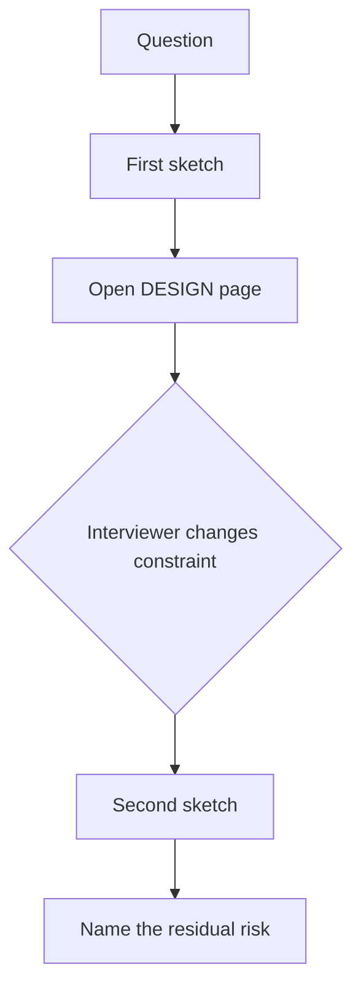

# Architect / principal interviews

Questions with **no single correct answer**. A strong answer names a trade-off, a failure mode, and a page in this lab. The lab’s DESIGN surfaces are comparison pages, reference architectures, and “what a principal would challenge” sections — there is no separate `18-design-challenge.md` set.

Use these in an interview loop: candidate talks, then they open the linked DESIGN page and argue **against** their first sketch.

## How to use this set

| Mode | What you do |
|---|---|
| SEE | Read the question and the linked DESIGN page |
| DO | Sketch two designs that disagree |
| BREAK | Name how each design fails (ACL, agency, judge, SQL) |
| DESIGN | Defend one under a constraint the interviewer changes |

## Questions (no single answer)

### 1. Agent or not?

The business asked for “an AI agent over our orders.” When do you refuse? What do you ship instead?

**DESIGN pages:** [When not an agent](../10-AGENTS/19-comparison.md) · [Foundations when-not](../01-FOUNDATIONS/19-comparison.md) · [RAG vs agent sheet](../50-CHEAT-SHEETS/rag-vs-agent.md)

A principal would challenge a `tools=` list of length 1 that is always called.

### 2. Where does the ACL live?

Two tenants share an index. Is the filter in the query, after retrieve, or in the prompt?

**DESIGN pages:** [Naive / hybrid / ACL](../08-RAG/19-comparison.md) · [Arch A](../40-REFERENCE-ARCHITECTURES/A-enterprise-rag.md) · [BREAK ACL](../43-EXPERIMENTS/01-overview.md)

### 3. When is retrieve allowed to loop?

Your first retrieve misses 30% of gold chunks. Do you add agentic RAG, a rewrite workflow, or fix chunking?

**DESIGN pages:** [When not agentic RAG](../09-AGENTIC-RAG/19-comparison.md) · [09 overview](../09-AGENTIC-RAG/01-overview.md)

### 4. Judge score went up. Can you ship?

The LLM-as-judge is the same family as the system. Gold is ten chats from the PM.

**DESIGN pages:** [When chats are not eval](../18-EVALUATION/19-comparison.md) · [How eval fails](../18-EVALUATION/14-failure-modes.md) · [Gold vs judge](../18-EVALUATION/02-simple.md)

### 5. MCP or three functions?

Five teams want “the standard tool bus.” You have three in-process calls today.

**DESIGN pages:** [MCP vs function calling](../13-MCP/19-comparison.md) · [MCP vs tools sheet](../50-CHEAT-SHEETS/mcp-vs-tools.md)

### 6. Who is the deputy?

A supervisor agent can call a worker that has warehouse admin. The user is a read-only analyst.

**DESIGN pages:** [Arch E](../40-REFERENCE-ARCHITECTURES/E-multi-agent.md) · [Multi-agent](../14-MULTI-AGENT-SYSTEMS/19-comparison.md) · [L7](../42-CAPSTONE-PROJECTS/L07.md)

### 7. NL-to-SQL or a semantic layer?

The demo generates beautiful SQL. The warehouse has PII columns and no row filter.

**DESIGN pages:** [When not SQL](../15-NL2SQL/19-comparison.md) · [Arch C](../40-REFERENCE-ARCHITECTURES/C-nl2sql.md) · [NL2SQL sim](../simulations.html)

### 8. Is the model the guardrail?

Security wants a second LLM to vote “safe” before `cancel_order`.

**DESIGN pages:** [Model is not a filter](../22-GUARDRAILS/19-comparison.md) · [Arch B](../40-REFERENCE-ARCHITECTURES/B-enterprise-agent.md)

### 9. Canonical arch or a SKU slide?

A vendor map shows six product names. Which boxes are durable vs volatile?

**DESIGN pages:** [When not a SKU dump](../26-AI-CLOUD-ARCHITECTURE/19-comparison.md) · [Canonical reference](../00-MASTER-MAP/reference-architecture.md) · [Arch index](../40-REFERENCE-ARCHITECTURES/01-overview.md)

### 10. What would you not automate?

A data-engineering agent can `DROP` a table that failed a test. Where is HITL, and what does the human see?

**DESIGN pages:** [Arch D](../40-REFERENCE-ARCHITECTURES/D-data-engineering-agent.md) · [Guardrails HITL](../22-GUARDRAILS/19-comparison.md)

## What a principal would challenge

An interview answer that names a vendor SKU but cannot name the failure mode on [Arch A–E](../40-REFERENCE-ARCHITECTURES/01-overview.md).

## What should I learn next?

[Anti-patterns](../47-ANTI-PATTERNS/01-overview.md) · [Glossary](../48-GLOSSARY/01-overview.md)
