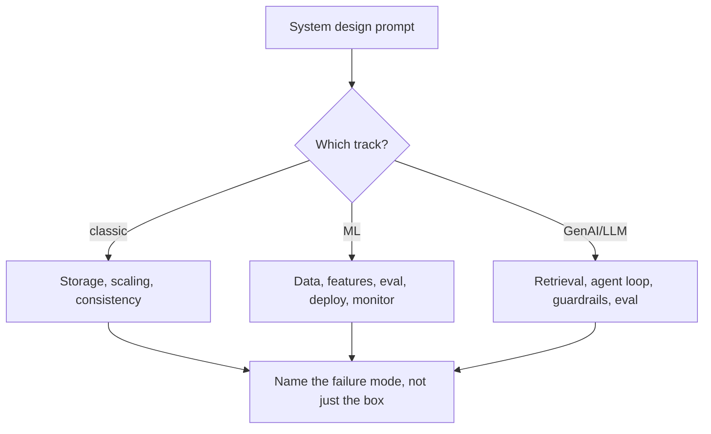
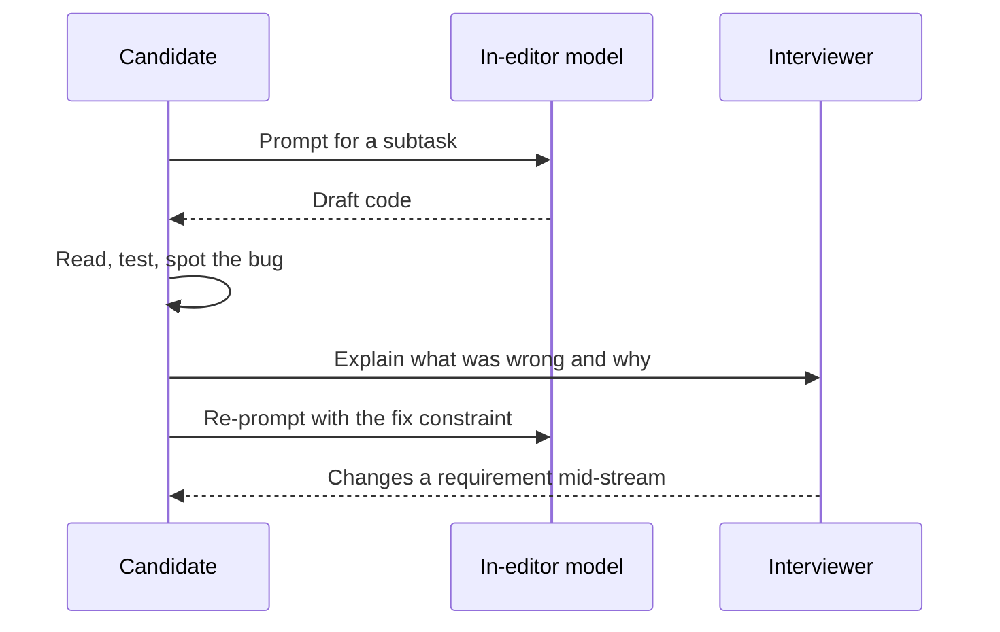

# The AI-era interview landscape (last two to three quarters)

> **Volatile page.** Everything below is reported by interview-prep vendors and coaching
> blogs (Tier 3/4 — see `source-strategy.md`), not by an official company careers page or
> engineering blog. No named company's policy here is Tier 1-confirmed. Use this as a radar
> for what to prepare for, not as a fact you repeat to a candidate as company policy. Loops
> vary by team, level, and region even within one company. Re-verify before relying on it.

## 1. The DSA/algorithms round did not go away — it got retooled

Zero of 52 surveyed FAANG interviewer-respondents said their company dropped algorithmic
questions. What changed is the shape of the question and what earns credit:

- Longer, multi-part prompts instead of single-shot LeetCode clones; custom problems written
  to resist a pasted solution.
- Credit shifts from "solved it fast" to "narrated the trade-off while solving it" — silent
  correct code on a hard problem now rates below narrated correct code on a medium one.
- More debugging-given-partially-wrong-code and "extend this snippet" formats, because those
  resist copy-paste more than blank-page coding.
- Deeper fundamentals follow-ups (why this complexity, what if the input 10x's, what if it
  must run mid-stream) rather than accepting a working answer at face value.

**What to change in practice:** drill pattern recognition (two pointers, sliding window,
graph traversal, DP shapes) over memorized solutions, and rehearse thinking out loud —
silence is now a negative signal, not a neutral one. (`SRC-INTERVIEWING-IO-AI-SURVEY-2026`)

## 2. System design split into three tracks

"System design" used to mean one thing. It is now commonly asked as up to three separate
conversations, and candidates are expected to know which one they are in.

| Track | What it tests | Durable core | Volatile edge | Example prompt |
|---|---|---|---|---|
| Classic distributed systems | Scaling, storage, queues, caching, consistency, failure domains | Yes — CAP, partitioning, idempotency, backpressure do not change | Which managed service names come up | Design a URL shortener / rate limiter / news feed |
| ML system design | Data → features → model → eval → deploy → monitor → retrain lifecycle | Yes — the lifecycle and its failure modes are stable | Which model family, which feature store | Design a fraud-detection or recommendation pipeline |
| GenAI / LLM system design | RAG pipelines, agent/tool loops, multi-agent orchestration, LLM inference platforms | Partially — retrieval, grounding, and evaluation-before-ship are durable | Model names, context-window sizes, framework choices | Design an LLM inference platform, a document-QA assistant, or a multi-agent workflow |

Reported framing: "evaluation methodology is the new system design" for the ML and GenAI
tracks — interviewers weight cost, latency, guardrails, and monitoring over the architecture
diagram itself. (`SRC-FORMATION-FAANG-AI-2026`)

This lab already teaches the durable core of the GenAI track — do not re-derive it from a
blog. See [08-RAG](../08-RAG/01-overview.md), [10-AGENTS](../10-AGENTS/01-overview.md),
[14-MULTI-AGENT-SYSTEMS](../14-MULTI-AGENT-SYSTEMS/01-overview.md), and the
[reference architectures A–E](../40-REFERENCE-ARCHITECTURES/01-overview.md).

## 3. The new "AI-assisted coding round"

Distinct from both the classic DSA round and take-home work: the candidate codes *with* a
model in the room, and the model's output is part of the artifact being graded.

- Reported at Meta (a discrete "AI-Enabled" slot in E4–E6 loops, and reportedly the *only*
  coding round at E7+), piloted at Google (an AI-assisted "code comprehension" format), and
  run at Netflix, Shopify, Scale AI, and OpenAI in similar shapes.
- Typically CodeSignal/CoderPad-style, with a model (GPT-4o-class, Claude, or Gemini) wired
  into the editor.
- Graded differently from DSA: prompt quality, task decomposition, whether the candidate
  catches a wrong or subtly-broken model suggestion, and verification discipline — not typing
  speed. (`SRC-INTERVIEWING-IO-AI-SURVEY-2026`, `SRC-FORMATION-FAANG-AI-2026`)

## 4. Companies split on AI-allowed vs AI-banned, and detection is an arms race

| Reported stance | Companies named | Consequence if violated |
|---|---|---|
| Bans covert AI use | Amazon, Goldman Sachs, Anthropic | Amazon: disqualification; general risk of a do-not-hire flag |
| Expects/allows AI use | Canva (Copilot/Cursor/Claude expected), Meta (dedicated AI round), Microsoft (AI-assisted SDE rounds reported) | N/A — it is the point of the round |

Every company name in that table is a vendor-blog claim
(`SRC-INTERVIEWMAN-AI-POLICY-2026`) — **UNVERIFIED** absent that company's own statement.
Confirm the specific loop's rules with the recruiter before the interview; do not assume.

Detection methods reported in the wild: full-screen-share requirements, disabled background
filters, proctoring for tab/focus loss and paste bursts, and keystroke/paste-pattern logging.
The one signal every source agrees resists AI assistance: a human asking the candidate to
explain or modify their own code live. Reported cheating-prevalence figures (a vendor's own
sample, self-selected and not independently audited) range widely — treat any specific
percentage as a lower or upper bound from one dataset, not an industry constant.

## 5. Behavioral rounds reportedly gained scope — and a new staple question

One vendor's estimate: behavioral share of the loop grew from roughly 10–15% to 30–40%
(`SRC-FORMATION-FAANG-AI-2026` — the underlying percentage itself is unverified; treat the
direction, "behavioral got bigger," as the more durable part of the claim). The new staple
question is some form of *"how do you actually use AI in your day-to-day work?"* Evaluators
report weighting:

- Specific tasks delegated to a model vs kept manual, and why.
- A concrete case of catching and correcting a model's wrong output.
- How the candidate verifies AI-assisted work before it ships.

Generic "AI makes me more productive" answers are reported to fall flat; specific
catch-the-error stories are reported to land well.

## 6. A distinct AI / applied-AI engineering interview track

Separate from "SWE interview with an AI round bolted on": roles titled AI engineer, applied
AI engineer, or LLM engineer are reported to run their own loop shape:

1. **Narrative round** (~45 min) — one system the candidate built end to end: what broke,
   what they measured, what they'd change.
2. **Engineering-signal round** (~60–90 min) — real code in a realistic setting: extend a
   small existing codebase, debug a failing pipeline, work with intentionally imperfect data.
3. **AI system-design round** (~60 min) — grounded in the interviewer's own product, with
   real constraints: latency budget, cost ceiling, data-sensitivity limits, a quality bar.
4. **Evaluation round** — how would you build a golden set, run an LLM-as-judge, and catch a
   regression before it reaches production. Reported as increasingly load-bearing: "eval
   methodology is the new system design" shows up again here, not only in ML system design.

**Topic checklist** (each already has a home in this lab — do not re-teach it here, follow
the link):

- LLM fundamentals, tokenization, decoding/sampling → [03-LLM-ENGINEERING](../03-LLM-ENGINEERING/01-overview.md)
- Context management, structured output → [04-PROMPT-ENGINEERING](../04-PROMPT-ENGINEERING/01-overview.md), [05-LLM-APPLICATION-ENGINEERING](../05-LLM-APPLICATION-ENGINEERING/01-overview.md)
- Embeddings and vector search trade-offs → [06-EMBEDDINGS](../06-EMBEDDINGS/01-overview.md), [07-VECTOR-DATABASES](../07-VECTOR-DATABASES/01-overview.md)
- RAG pipeline design, when RAG beats fine-tuning → [08-RAG](../08-RAG/01-overview.md), [09-AGENTIC-RAG](../09-AGENTIC-RAG/01-overview.md)
- Agent and tool-calling design, when *not* to use an agent → [10-AGENTS](../10-AGENTS/19-comparison.md), [12-TOOLS-FUNCTION-CALLING](../12-TOOLS-FUNCTION-CALLING/01-overview.md)
- Multi-agent patterns (supervisor, handoff, parallel, hierarchy) → [14-MULTI-AGENT-SYSTEMS](../14-MULTI-AGENT-SYSTEMS/01-overview.md)
- Evaluation methodology, golden sets, LLM-as-judge pitfalls → [18-EVALUATION](../18-EVALUATION/01-overview.md)
- Prompt injection, guardrails, the OWASP GenAI LLM Top 10 → [21-AI-SECURITY](../21-AI-SECURITY/01-overview.md), [22-GUARDRAILS](../22-GUARDRAILS/01-overview.md), [security cheat sheet](../50-CHEAT-SHEETS/security-top10.md)
- Observability, cost, and latency at inference time → [19-OBSERVABILITY](../19-OBSERVABILITY/01-overview.md), [38-AI-COST](../38-AI-COST/01-overview.md)
- Reference architectures to defend under a changed constraint → [40-REFERENCE-ARCHITECTURES](../40-REFERENCE-ARCHITECTURES/01-overview.md)

## What this page is deliberately silent on

This lab teaches **AI engineering**, not general computer-science fundamentals. DSA/algorithm
*content* (arrays, trees, graphs, DP) is out of scope here the same way basic Python/SQL is
out of scope elsewhere in this repo (`contribute-concept` skill, "do not reteach basics") —
practice that against a general DSA judge. What this lab adds is everything AI-specific: the
GenAI system-design track, the AI-assisted-round mental model, and the evaluation-first
framing above.

## What should I learn next?

[30/60/90-day prep plan](03-prep-plan-30-60-90.md) · [Reusable prep prompt](04-reusable-prep-prompt.md) · [Architect / principal interviews](01-overview.md)
