# 30/60/90-day prep plan for the AI-era loop

Three tracks, not three difficulty levels. Pick the one that matches your situation — do not
default to 90 days out of caution, and do not compress into 30 days without the fundamentals
this plan assumes.

| Track | Pick this if | Assumes going in |
|---|---|---|
| **30-day — Fast loop** | You have a scheduled onsite/virtual loop inside four weeks | Solid existing DSA fluency and at least one system-design track; you need calibration, not construction |
| **60-day — Standard** | You are actively interviewing without a fixed date | Some DSA rust, one system-design track shaky, little to no AI-round exposure |
| **90-day — Comprehensive** | You are moving into an AI/applied-AI track from a different background, or targeting senior/staff+ | Need to build DSA fluency, all three system-design tracks, and AI-specific depth from scratch |

See [02-ai-era-interview-landscape.md](02-ai-era-interview-landscape.md) for what each column
below is calibrated against.

```mermaid
gantt
  title Where each track spends its time
  dateFormat  X
  axisFormat %s
  section 30-day (fast)
  DSA calibration + narration drill   :a1, 0, 10
  One system-design track, mock-heavy :a2, 5, 15
  AI-round + behavioral polish        :a3, 20, 10
  section 60-day (standard)
  DSA pattern rebuild                 :b1, 0, 20
  Two system-design tracks            :b2, 15, 30
  AI-track fundamentals + mocks       :b3, 35, 25
  section 90-day (comprehensive)
  DSA fundamentals to fluency         :c1, 0, 30
  All three system-design tracks      :c2, 20, 45
  AI-track depth + full mock loop     :c3, 55, 35
```

## 30-day — Fast loop

| Week | DSA / algorithms | System design | AI-specific | Behavioral / mocks |
|---|---|---|---|---|
| 1 | Diagnostic set (10 mixed problems); triage weak patterns | Pick your most-likely track (classic, ML, or GenAI); redo one reference design | Skim [02-ai-era-interview-landscape.md](02-ai-era-interview-landscape.md); confirm the target company's AI-round policy with your recruiter | Draft 3 "how I use AI day-to-day" stories with a concrete catch-the-error example |
| 2 | 2 problems/day from weak patterns, narrated out loud, timed | 2 mock design sessions on the chosen track, explicit failure-mode naming | If a GenAI-track or AI-assisted round is confirmed: read the linked RAG/agent/evaluation pages once each | 1 mock behavioral round; tighten stories to STAR + explicit trade-off |
| 3 | Mixed timed set simulating the real round length; drill debugging-given-broken-code | 1 more mock, now with the interviewer changing a constraint mid-answer | 1 mock AI-assisted-coding round if applicable: prompt, verify, catch a planted bug | Second behavioral mock; record and review your own narration |
| 4 | Light maintenance only (1 problem/day); rest before the loop | Final review of your reference architecture diagrams | Final review of the eval-methodology checklist (golden set, judge choice, regression gate) | Logistics: confirm tools allowed/banned per round, test your environment |

**Ready check:** you can solve a medium problem while narrating trade-offs without going
silent, you can defend one system design under a changed constraint, and you have a
specific (not generic) AI-usage story.

## 60-day — Standard

| Weeks | DSA / algorithms | System design | AI-specific | Behavioral / mocks |
|---|---|---|---|---|
| 1–2 | Rebuild pattern coverage (arrays/strings, trees/graphs, DP, two pointers/sliding window) — untimed first pass | Study the three-track split; read one reference architecture per track | Read [02-ai-era-interview-landscape.md](02-ai-era-interview-landscape.md) fully; skim [18-EVALUATION](../18-EVALUATION/01-overview.md) | Write your career narrative and 5 core stories |
| 3–4 | Timed practice, narrated; start mixing in debug-given-code problems | Pick two tracks (classic + one of ML/GenAI based on target role); 2 mocks total | Work through [08-RAG](../08-RAG/01-overview.md) and [10-AGENTS](../10-AGENTS/19-comparison.md) "when not to" pages | 1 mock behavioral, focused on the AI-usage question |
| 5–6 | Full-length timed sets; target your weakest pattern specifically | 2 more mocks across your two tracks; require yourself to name a failure mode unprompted | If applicable, 1 mock AI-assisted coding round; practice reading and correcting model output live | 1 mock combining behavioral + a short AI-usage follow-up |
| 7–8 | Maintenance pace; add company-tagged practice if known | Final mock per track under time pressure | Review [21-AI-SECURITY](../21-AI-SECURITY/01-overview.md) / [22-GUARDRAILS](../22-GUARDRAILS/01-overview.md) if the target role touches agents or tools | Full dry-run loop, back to back, same length as the real thing |

**Ready check:** you can pass a cold mock in each of your two chosen system-design tracks
without your own coaching notes, and you can complete an AI-assisted-round mock without
accepting a model's wrong output silently.

## 90-day — Comprehensive

| Weeks | DSA / algorithms | System design | AI-specific | Behavioral / mocks |
|---|---|---|---|---|
| 1–3 | Learn/relearn every core pattern from fundamentals; untimed, focus on correctness and explanation | Learn the vocabulary of all three tracks (scaling primitives; ML lifecycle; RAG/agent/inference basics) | Work this lab's spine in order: [01-FOUNDATIONS](../01-FOUNDATIONS/01-overview.md) → [03-LLM-ENGINEERING](../03-LLM-ENGINEERING/01-overview.md) → [08-RAG](../08-RAG/01-overview.md) | Draft full career narrative; collect raw stories, don't polish yet |
| 4–6 | Timed practice begins; narrate every solution out loud even alone | First mock in each of the three tracks; expect to fail some — that's the diagnostic | Continue the spine: [10-AGENTS](../10-AGENTS/01-overview.md) → [14-MULTI-AGENT-SYSTEMS](../14-MULTI-AGENT-SYSTEMS/01-overview.md) → [18-EVALUATION](../18-EVALUATION/01-overview.md) | Polish stories into STAR with an explicit trade-off named in each |
| 7–9 | Timed, mixed sets; add debug-given-broken-code and "extend this snippet" formats weekly | Second mock per track, now defending under a changed constraint; study [40-REFERENCE-ARCHITECTURES](../40-REFERENCE-ARCHITECTURES/01-overview.md) A–E | [21-AI-SECURITY](../21-AI-SECURITY/01-overview.md), [22-GUARDRAILS](../22-GUARDRAILS/01-overview.md), [50-CHEAT-SHEETS](../50-CHEAT-SHEETS/01-overview.md); build your own golden-set example for a toy RAG app | Mock AI-usage question weekly until answers are specific and varied |
| 10–12 | Full-length, full-difficulty timed sets; target only remaining weak patterns | Final mock per track, cold, interviewer-style; review [01-overview.md](01-overview.md) principal-level questions | Full mock AI-assisted-coding round; full mock AI-system-design round grounded in a real product constraint | Full dry-run loop(s), back to back, at real length; debrief and iterate |

**Ready check:** you can be handed any of the three system-design tracks cold and produce a
defensible design with named failure modes; you can complete a full mock loop (DSA + design +
AI round + behavioral) back to back without fatigue-driven mistakes on the last stage.

## Daily rhythm (all tracks)

- One DSA problem narrated out loud, even on light days — silence is graded down in the
  current landscape (`02-ai-era-interview-landscape.md`, section 1).
- One short read from the topic checklist rather than a fresh blog post each day — this lab's
  pages are durable; most interview-prep blogs churn.
- Log every mock's specific feedback in one place and re-test the same weakness within a
  week, not "eventually."

## Self-assessment rubric

Map directly onto what interviewers are reported to weight now:

| Signal | Weak | Strong |
|---|---|---|
| DSA narration | Silent until code is done | Talks through approach, complexity, and edge cases while coding |
| System design track discipline | Mixes classic/ML/GenAI concerns without naming which track you're in | States the track, then reasons inside it |
| AI-assisted round | Accepts model output at face value | Catches a wrong suggestion and explains why it's wrong before fixing it |
| Evaluation fluency | Says "we'd write some tests" | Names a golden set, a judge method, and a regression gate |
| Behavioral AI-usage story | "AI makes me faster" | Names a specific task, a specific model error caught, and how it was verified |

## What should I learn next?

[Practice drill library](05-practice-drill-library.md) · [Reusable prep prompt](04-reusable-prep-prompt.md) · [The AI-era interview landscape](02-ai-era-interview-landscape.md) · [Architect / principal interviews](01-overview.md)
