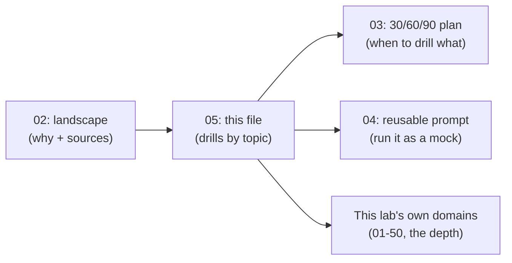

# Practice drill library — prompts by topic

> **Volatile framing, durable prompts.** The "why it's tested now" line under each topic is
> reported interview-market color (Tier 3/4 sources plus learner-compiled trend notes) — mark
> any specific number or company claim **UNVERIFIED** unless a source is cited. The prompts and
> question patterns themselves are durable: they work as practice-generator seeds regardless of
> whether this quarter's trend numbers hold. See
> [02-ai-era-interview-landscape.md](02-ai-era-interview-landscape.md) for the sourced version
> of the trend claims and [source-strategy.md](../99-META/source-strategy.md) for tier rules.

## How to use this library

Each of the 15 topics below has four parts:

1. **Why it's tested now** — one line of market color, cross-linked to the sourced landscape
   page instead of repeating unsourced numbers here.
2. **Concept checklist** — the minimum you should recognize by name; links to this lab's own
   pages for the depth, so this file stays a drill list, not a re-teach.
3. **Ready-to-use prompts** — paste directly into an LLM chat, a practice-question generator,
   or [the reusable coaching prompt](04-reusable-prep-prompt.md), as-is.
4. **Real question pattern** — the shape interviewers reportedly use, so you recognize it live
   instead of pattern-matching to a memorized answer.

Pair this file with [the 30/60/90-day plan](03-prep-plan-30-60-90.md) for scheduling (which
weeks to drill which topics) and with the [master prompt template](#master-prompt-template) at
the end to generate a fresh drill for any topic/level combination on demand.



---

## 1. DSA (data structures & algorithms) and coding fundamentals

**Why it's tested now:** Reported as still one of the most common interview components at
large tech companies even with AI coding tools in wide use — heavier weight early-career,
lighter but still present at senior level. See
[02-ai-era-interview-landscape.md §1](02-ai-era-interview-landscape.md#1-the-dsaalgorithms-round-did-not-go-away--it-got-retooled)
for the sourced version of how the *format* changed. **Out of this lab's scope by design**:
DSA content itself (arrays, trees, DP) is general computer science, not AI engineering — this
lab gives you prompts to *practice* it elsewhere, not the lessons themselves.

**Concept checklist:**
- Arrays, strings, hashing (hash map — key/value lookup with near-instant average lookup)
- Two pointers, sliding window (moving a fixed- or variable-size window to avoid re-scanning)
- Trees and graphs (traversal; breadth-first vs depth-first search)
- Dynamic programming (overlapping sub-problems with cached results)
- Heaps/priority queues, tries, union-find (disjoint set)
- Time/space complexity (Big-O) trade-off reasoning
- Pattern recognition over memorized solutions

**Ready-to-use prompts:**
- "Give me a medium-difficulty problem that uses [pattern], with no solution yet — let me attempt it first."
- "I solved this in O(n²). Ask me guiding questions (don't give the answer) to help me find an O(n log n) approach."
- "Review my code for this problem and point out edge cases I likely missed, without rewriting my solution."
- "Generate 5 problems on [pattern] in increasing difficulty, each one line, no solutions."

**Real question pattern:** company-tagged variations of classic patterns (sliding window, DP,
graph traversal), graded as much on communication and edge-case handling as on the answer.

---

## 2. Classic system design (distributed systems)

**Why it's tested now:** Reported as no longer senior-only — this lab's landscape page cites
the three-track split (classic / ML / GenAI) now common at large companies; see
[02-ai-era-interview-landscape.md §2](02-ai-era-interview-landscape.md#2-system-design-split-into-three-tracks).
Which specific level first sees it (e.g. "as early as L4") is a per-company, per-source claim —
**UNVERIFIED** here; confirm against the target company's own leveling guide.

**Concept checklist** — this lab's durable core lives in
[40-REFERENCE-ARCHITECTURES](../40-REFERENCE-ARCHITECTURES/01-overview.md); the classic-systems
vocabulary itself (load balancing, consistent hashing, CAP theorem, sharding, replication) is
general distributed-systems knowledge, not AI-specific, so treat it the same way as DSA above —
practice it broadly, use this lab for the AI-specific tracks.
- Requirements gathering (functional vs non-functional) before designing anything
- Load balancing, consistent hashing
- Caching strategies (cache eviction, e.g. LRU — least recently used)
- Database indexing (B-trees), SQL vs NoSQL trade-offs, sharding
- Data pipelines (batch vs streaming) — see [16-AI-DATA-ENGINEERING](../16-AI-DATA-ENGINEERING/01-overview.md) for the AI-adjacent version
- Fault tolerance, replication, consistency models (CAP theorem)
- API design and rate limiting

**Ready-to-use prompts:**
- "Act as an interviewer. Ask me to design [system, e.g. a URL shortener], then push back on my first answer the way a real interviewer would."
- "I designed [system] this way — what's the biggest scalability weakness a staff engineer would flag?"
- "Compare SQL vs NoSQL for [scenario] and make me defend my choice out loud."
- "Give me a system design prompt reportedly used at [company] recently, without the sample answer."

**Real question pattern:** design a scalable, reliable system for a real-world scenario (e.g.
notification system, ride-sharing dispatch), graded on trade-off reasoning across the stack,
not just the diagram.

---

## 3. GenAI / LLM system design

**Why it's tested now:** This lab's landscape page documents this as a distinct third track
alongside classic and ML system design; see
[02-ai-era-interview-landscape.md §2](02-ai-era-interview-landscape.md#2-system-design-split-into-three-tracks).
Any specific growth-rate claim (e.g. "roughly tripled since 2023") is **UNVERIFIED** — no Tier
1/2 source in this lab's registry confirms a number; treat only the direction as durable.

**Concept checklist** — full depth in
[08-RAG](../08-RAG/01-overview.md), [10-AGENTS](../10-AGENTS/01-overview.md), and
[40-REFERENCE-ARCHITECTURES B](../40-REFERENCE-ARCHITECTURES/B-enterprise-agent.md):
- End-to-end architecture: user request → gateway → retrieval/context → model inference → response
- Latency and streaming (token-by-token delivery) trade-offs
- Token cost management at scale — see [38-AI-COST](../38-AI-COST/01-overview.md)
- Grounding (tying output to real data) to reduce hallucination
- Choosing fine-tune vs RAG vs prompt engineering
- Multi-modal considerations (text, image, audio) where relevant

**Ready-to-use prompts:**
- "Ask me to design an LLM-powered [customer support bot / document search / coding assistant], and interrupt me if I skip a requirement a real interviewer would probe."
- "I said I'd reduce token costs by [approach] — what's the trade-off I'm not accounting for?"
- "Give me 3 recently-reported GenAI system design questions from large AI-native companies, without answers."

**Real question pattern:** "Design a high-level system for an LLM responding to a user query,"
"design a customer-support chatbot on top of a third-party LLM platform," "design safeguards
for an AI system that can take actions on a user's behalf."

---

## 4. Context & RAG (retrieval-augmented generation)

**Why it's tested now:** RAG is a standard system-design sub-topic and a common standalone
question set for AI/ML/prompt engineer roles — durable, not a 2026-only fad; this lab teaches
the full mechanism in [08-RAG](../08-RAG/01-overview.md) and
[09-AGENTIC-RAG](../09-AGENTIC-RAG/01-overview.md).

**Concept checklist:**
- Chunking strategy and its effect on retrieval quality
- Embeddings (text → numeric vectors for similarity search) and vector databases — [06-EMBEDDINGS](../06-EMBEDDINGS/01-overview.md), [07-VECTOR-DATABASES](../07-VECTOR-DATABASES/01-overview.md)
- Retrieval vs reranking
- Hybrid search (keyword + vector/semantic)
- Context-window limits when many chunks are retrieved
- Permission-aware retrieval — [08-RAG comparison](../08-RAG/19-comparison.md)
- Evaluating retrieval quality separately from the final generated answer — [18-EVALUATION](../18-EVALUATION/01-overview.md)

**Ready-to-use prompts:**
- "Walk me through designing a RAG pipeline for [internal documentation search], and challenge my chunking strategy."
- "A RAG system retrieves 20 chunks but the context window only fits 5 — ask me how I'd decide which to keep."
- "Give me a scenario where two retrieved documents conflict — how should the system handle it?"
- "Quiz me on the difference between retrieval evaluation metrics and generation evaluation metrics."

**Real question pattern:** "Design a retrieval-augmented chatbot for enterprise search," plus
deep-dive follow-ups on chunking, reranking, and how to evaluate the system once it's live.

---

## 5. Agent loops & frameworks

**Why it's tested now:** As AI systems take actions rather than only answer questions,
interviewers reportedly probe how an agent plans, acts, and monitors its own progress. Durable
core in [10-AGENTS](../10-AGENTS/01-overview.md), including the [when-not-an-agent
comparison](../10-AGENTS/19-comparison.md) — the strongest answers in this topic often start by
refusing the agent framing when a workflow would do.

**Concept checklist:**
- The agent loop: plan → execute → observe → adjust
- Task decomposition (breaking a goal into smaller steps)
- State management across multi-step tasks
- Error handling and recovery when a step fails
- When to use an agent vs a simple, direct tool call

**Ready-to-use prompts:**
- "Ask me to design the control loop for an agent that [books a meeting across calendars], including failure handling."
- "I designed my agent loop without a retry mechanism — what breaks in production?"
- "Compare a single-shot tool call vs a full agent loop for [task] and have me justify which fits better."

**Real question pattern:** "Describe how you'd architect an AI agent system, including the
loop, tools, memory, and safety considerations."

---

## 6. ReAct-style reasoning (reason + act)

**Why it's tested now:** Underpins most production agent frameworks, so interviewers use it to
check whether a candidate understands *why* agents interleave reasoning and action rather than
planning everything up front. See [10-AGENTS](../10-AGENTS/01-overview.md) for where this sits
relative to the other agent flavors in the [master taxonomy](../00-MASTER-MAP/master-taxonomy.md).

**Concept checklist:**
- The think → act → observe → repeat cycle
- Why interleaving reasoning with actions reduces compounding errors
- Structured prompting (a consistent, parseable output format at each step) — [04-PROMPT-ENGINEERING](../04-PROMPT-ENGINEERING/01-overview.md)
- Where this pattern breaks down: long tasks, costly actions, ambiguous observations

**Ready-to-use prompts:**
- "Explain a case where a plan-first agent would fail but a reason-and-act-style agent would succeed."
- "Trace a reason-act loop step-by-step for [task] and ask me to predict what happens if step 2's observation is wrong."

**Real question pattern:** usually embedded inside an agent system-design question rather than
asked standalone — expect a follow-up like "how does the agent know when to stop or ask for
help?"

---

## 7. MCP & tool integration

**Why it's tested now:** As agents need to reach real data and APIs, interviewers probe secure,
standardized tool access rather than hard-coded one-off integrations. Full mechanism (host,
client, server; trust boundaries) in [13-MCP](../13-MCP/01-overview.md) and
[12-TOOLS-FUNCTION-CALLING](../12-TOOLS-FUNCTION-CALLING/01-overview.md); the
[MCP-vs-tools cheat sheet](../50-CHEAT-SHEETS/mcp-vs-tools.md) is the fast version of the
trade-off.

**Concept checklist:**
- Model Context Protocol (MCP) — a standard way for an agent to discover and call tools
- Standardized tool schemas vs ad-hoc API glue
- Authentication and scoping (limiting what a tool call can access)
- Tool selection (how the agent picks the right tool from many)

**Ready-to-use prompts:**
- "Ask me to design a tool-integration layer for an agent that needs access to [databases, APIs, internal docs], focusing on security boundaries."
- "What's the risk of giving an agent an unscoped API key, and how would you fix it?"

**Real question pattern:** folded into agent or GenAI system-design answers — expect to be
asked how the model knows which tools exist and how calls are authorized.

---

## 8. Multi-agent systems

**Why it's tested now:** As single-agent systems hit limits on complex tasks, interviewers
reportedly ask how candidates coordinate multiple specialized agents. Durable patterns
(supervisor, handoff, parallel, hierarchy) in
[14-MULTI-AGENT-SYSTEMS](../14-MULTI-AGENT-SYSTEMS/01-overview.md) and
[reference architecture E](../40-REFERENCE-ARCHITECTURES/E-multi-agent.md).

**Concept checklist:**
- Task decomposition across specialized agents (planner + retrieval + coding, for example)
- Inter-agent communication and shared state/memory
- Orchestration (who decides which agent runs next) — [11-AGENT-ORCHESTRATION](../11-AGENT-ORCHESTRATION/01-overview.md)
- Failure isolation (one agent failing shouldn't crash the whole system)

**Ready-to-use prompts:**
- "Design a multi-agent system for [research and report generation] and challenge me on how the agents avoid duplicating work."
- "What happens if two agents in your system disagree on the next action? Ask me to design the resolution."

**Real question pattern:** increasingly a deep-dive follow-up within GenAI system design rather
than its own question — "how would this change if you needed three specialized agents instead
of one?"

---

## 9. AI gateway (cost, routing, inference economics)

**Why it's tested now:** As AI spend becomes a real budget line, interviewers reportedly expect
engineers to design for cost, not just correctness. See
[38-AI-COST](../38-AI-COST/01-overview.md) for the durable cost model and
[20-LLMOPS](../20-LLMOPS/01-overview.md) for the versioning/routing operational side.

**Concept checklist:**
- Model routing (simple requests to a cheaper/smaller model, complex ones to a larger model)
- Rate limiting and usage monitoring
- Caching model responses (semantic caching — caching by meaning, not exact text match)
- Inference cost drivers: token count, model size, request volume

**Ready-to-use prompts:**
- "I need to cut LLM costs by 40% without hurting quality — ask me to justify three approaches."
- "Design a gateway that routes requests between two models by cost and complexity, and quiz me on the routing logic."

**Real question pattern:** "How would you reduce token costs in an LLM-powered product at
scale?"

---

## 10. Evaluation

**Why it's tested now:** AI systems are non-deterministic (the same input can produce different
outputs), so interviewers test whether candidates can measure quality before shipping. This
lab's landscape page calls this out twice — for ML system design and for GenAI system design —
as "evaluation methodology is the new system design"; see
[02-ai-era-interview-landscape.md §2 and §6](02-ai-era-interview-landscape.md). Full mechanism
in [18-EVALUATION](../18-EVALUATION/01-overview.md), including its
[failure modes](../18-EVALUATION/14-failure-modes.md) and the
[eval cheat sheet](../50-CHEAT-SHEETS/eval.md).

**Concept checklist:**
- Offline evaluation (test sets, benchmarks) vs online evaluation (live user feedback)
- LLM-as-judge (a model grading another model's output) and its limits
- Regression testing for AI systems (catching quality drops after a change)
- Human-in-the-loop review for ambiguous cases
- Retrieval evaluation vs generation evaluation (for RAG specifically)

**Ready-to-use prompts:**
- "How would you evaluate a RAG system? Ask me to separate retrieval metrics from generation metrics."
- "Design an evaluation pipeline for an agent that completes multi-step tasks — what does 'success' even mean here?"
- "Critique my evaluation plan for gaps that would let a bad model pass."

**Real question pattern:** "How do you evaluate a RAG system?" and "how would you detect
quality regressions after a model or prompt change?"

---

## 11. Observability

**Why it's tested now:** Once an AI system is in production, interviewers reportedly want to
know how you'd notice something going wrong. Durable mechanism (traces, GenAI-specific
telemetry, cost/latency dashboards) in
[19-OBSERVABILITY](../19-OBSERVABILITY/01-overview.md).

**Concept checklist:**
- Traces (following one request through every step of the system)
- Cost and token dashboards
- Drift detection (model behavior quietly changing over time)
- Alerting thresholds for latency, error rate, and cost spikes

**Ready-to-use prompts:**
- "Design the observability layer for the RAG system we discussed — what would you track, and why those metrics specifically?"
- "My dashboard only shows latency. What's missing for an AI-specific system, and why does it matter?"

**Real question pattern:** usually a deep-dive question after a system design answer: "how
would you know if this degraded in production?"

---

## 12. Safety harnesses (guardrails & responsible AI)

**Why it's tested now:** As AI systems take real actions and handle real data, interviewers
reportedly test whether protections are built in by default. Durable mechanism in
[22-GUARDRAILS](../22-GUARDRAILS/01-overview.md) and
[21-AI-SECURITY](../21-AI-SECURITY/01-overview.md) (OWASP GenAI LLM Top 10 mapping); the
[security cheat sheet](../50-CHEAT-SHEETS/security-top10.md) is the fast version.

**Concept checklist:**
- Prompt filtering and output monitoring (catching unsafe or leaking outputs before the user sees them)
- Guardrails against prompt injection (malicious instructions hidden in retrieved content)
- Compliance-by-design (e.g. data-handling rules baked into architecture) — [23-PHI-PII-DLP](../23-PHI-PII-DLP/01-overview.md), [24-AI-GOVERNANCE](../24-AI-GOVERNANCE/01-overview.md)
- Human approval gates for high-stakes agent actions

**Ready-to-use prompts:**
- "Design safeguards for an AI system that can take actions on a user's behalf — ask me what happens when it's about to do something irreversible."
- "How would you prevent a RAG system from leaking private data it retrieved? Push me for a concrete mechanism, not a general principle."

**Real question pattern:** "Design safeguards for an AI system that can take actions on behalf
of a user" — reported as a standalone question at several companies now, not just a footnote.

---

## 13. Deployment & scale

**Why it's tested now:** Companies reportedly want to know a candidate can take a prototype
into reliable production infrastructure. Durable operational content in
[39-AI-PRODUCTION-OPERATIONS](../39-AI-PRODUCTION-OPERATIONS/01-overview.md),
[20-LLMOPS](../20-LLMOPS/01-overview.md) (versioning prompts/models/indexes), and
[37-AI-PERFORMANCE](../37-AI-PERFORMANCE/01-overview.md).

**Concept checklist:**
- CI/CD for AI systems (prompts, models, and data all version separately from code)
- Scaling inference (horizontal scaling, batching requests)
- Security and governance for AI infrastructure
- Cost optimization at scale (infrastructure-level, distinct from per-request routing in topic 9)

**Ready-to-use prompts:**
- "Take the RAG system we designed and ask me how I'd deploy and scale it to 10x current traffic."
- "What's different about CI/CD for a system that includes an LLM, versus a normal backend service?"

**Real question pattern:** usually the final deep-dive in a GenAI system-design interview —
"this works for 100 users, how does it change at 100,000?"

---

## 14. The AI-era behavioral / process round

**Why it's tested now:** This lab's landscape page documents "how do you use AI day-to-day" as
a reported new staple behavioral question, and a live "defend your decisions" follow-up after
take-homes; see
[02-ai-era-interview-landscape.md §5](02-ai-era-interview-landscape.md#5-behavioral-rounds-reportedly-gained-scope--and-a-new-staple-question).

**Concept checklist:**
- Explaining *how* and *why* you used AI tools on a task, not just that you did
- Defending every line of a take-home submission out loud, including parts you didn't write yourself
- Being explicit about what you'd double-check before trusting AI-generated code or output

**Ready-to-use prompts:**
- "Ask me how I used AI tools to solve [this problem], and push back until I can defend every decision without relying on 'the AI suggested it.'"
- "Simulate a live code-review follow-up to my take-home submission — ask me why I made three specific choices."

**Real question pattern:** a direct question about AI tool use in your workflow, plus an
in-person "walk me through your code and your decisions" round following any take-home.

---

## 15. Principal / staff / architect track

**Why it's tested this way:** There is no single template at this level — loop shape varies by
company — but the components that repeat form a predictable pattern. This overlaps directly
with [01-overview.md](01-overview.md) (architect/principal interviews) in this same folder; use
that page's ten open-ended design questions alongside the drills below.

**Typical loop (4–6 rounds over 1–2 days) — reported shape, confirm against the specific
company's own process:**

| Round | Format | What it's really checking |
|---|---|---|
| Coding (1–2 rounds, ~60 min each) | Still present, but a gate, not a differentiator | Correctness and reasoning, not cleverness |
| System design / architecture (~60 min) | Open-ended, often spanning multiple domains | Whether you scope the problem yourself and weigh cross-team trade-offs |
| Technical/domain deep dive | Discussion of a system you actually built | Your real decisions and their second-order consequences |
| Leadership & influence round | Behavioral, structured around past initiatives | Whether you can align stakeholders without direct authority |
| Strategy/business case | Scenario-based | How you diagnose, prioritize, and sequence work at portfolio level |
| Values/culture (~45 min) | Standard behavioral | Fit and conduct |

**What reportedly shifts vs. mid-level loops:**
- Coding drops in weight, not out entirely — system design and leadership rounds are where the
  loop is reportedly won or lost.
- System design becomes about judgment, not knowledge — you are expected to define scope
  yourself rather than solve a handed-down question.
- Behavioral rounds test organizational reach, not task execution: direction-setting at org
  scale, influence without formal authority, converting ambiguity into strategy, and resolving
  "right vs. right" trade-offs (both options defensible, no clean answer).
- The expected scope of every answer is bigger: the decision weight shifts from "did you solve
  the assigned problem" to "did you choose which problems deserved the team's capacity."

**Ready-to-use prompts:**
- "Act as a Principal Engineer interviewer. Give me an ambiguous architecture problem with no clear scope, and make me define the boundaries myself before I design anything."
- "I'm about to answer a system design question — interrupt me and ask how this decision affects budget, legacy systems, or compliance, not just technical correctness."
- "Give me a 'right vs. right' scenario (two valid but conflicting priorities) and push me to resolve it, then critique whether my resolution actually required organizational influence or was just a technical call."
- "Ask me to describe a past initiative where I had to influence a team I didn't manage. Push back on vague claims and demand a concrete mechanism I used."
- "Simulate a strategy/business case round: give me a vague business goal and make me turn it into a sequenced technical roadmap, questioning my prioritization at each step."

**Real question pattern:** "Walk me through a technical decision you made that had significant
organizational impact, including where you were wrong" / "How would you prioritize between
three conflicting infrastructure investments with a fixed budget?" / open-ended architecture
prompts with no stated constraints, where defining constraints is part of the evaluation. Cross
into [01-overview.md's ten questions](01-overview.md#questions-no-single-answer) for the
design-page-linked version of this same drill.

---

## Master prompt template

Parameterize this for any topic above (or any topic this lab covers) and any experience level:

```text
You are an interview coach for the topic: {TOPIC}.
Context: this topic is reportedly tested at {COMPANY_TYPE} companies as of {YEAR}, mainly as
{ROUND_TYPE} (e.g. system design deep-dive, standalone coding question, behavioral follow-up).
Candidate experience level: {EXPERIENCE_LEVEL} (e.g. 0-2 yrs, mid-level, senior, principal/staff).

1. Ask me ONE question in the real style companies currently use for this topic and level
   (use the "Real question pattern" for {TOPIC} in this drill library as your model).
2. Do NOT give the answer yet -- wait for my attempt.
3. After I answer, tell me which items from the {TOPIC} concept checklist I covered well and
   which I missed. At principal/staff level, also flag whether my answer showed organizational
   judgment and scope-ownership, not just technical correctness.
4. Ask one follow-up that a real interviewer would use to probe the gap.
5. Keep explanations in plain language, with any technical term defined inline in brackets the
   first time it's used.
6. If I ask for background rather than a drill, point me to this lab's own page for {TOPIC}
   instead of re-teaching it from scratch.
```

This composes with [the reusable coaching prompt](04-reusable-prep-prompt.md): use that one to
plan and run a full mock loop, and pull individual topic drills from here when you want to
go deep on one weak area between mocks.

## Skill-area map

| Topics (# above) | Skill area |
|---|---|
| 3, 13 | Deployment & scale |
| 4 | Context & RAG |
| 5 | Agent loops & frameworks |
| 6 | ReAct-style reasoning |
| 7 | MCP & tool integration |
| 8 | Multi-agent systems |
| 9 | AI gateway / inference economics |
| 10 | Evaluation |
| 11 | Observability |
| 12 | Safety harnesses / guardrails |
| 1, 2, 14, 15 | Cross-cutting — DSA, classic system design, the AI-era process round, and the principal track all draw on multiple skill areas at once |

## What should I learn next?

[30/60/90-day prep plan](03-prep-plan-30-60-90.md) · [The AI-era interview landscape](02-ai-era-interview-landscape.md) · [Reusable prep prompt](04-reusable-prep-prompt.md) · [Architect / principal interviews](01-overview.md)
