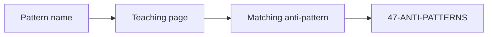

# Patterns the lab already teaches

Only patterns that already have a teaching page. This is an index, not a Gang-of-Four rewrite and not a new curriculum.

| Pattern | What it is | Not | Open |
|---|---|---|---|
| **Function-over-agent** | If you can write a function, do that (`SRC-MS-AGENT-FRAMEWORK`) | Wrapping a CronJob as an agent | [10 when-not](../10-AGENTS/19-comparison.md) |
| **Workflow-over-agent** | Enumerated steps stay a DAG / state machine | Free loop for a refund playbook | [11](../11-AGENT-ORCHESTRATION/01-overview.md) |
| **Retrieve-as-tool** | Agentic RAG: retrieve may run again under a budget | Agent-for-everything over docs | [09](../09-AGENTIC-RAG/01-overview.md) |
| **ACL-in-query** | Principal filter inside retrieve | Post-hoc drop of hits | [08 comparison](../08-RAG/19-comparison.md) |
| **Hybrid retrieve** | Lexical + vector (+ filters) | Vector-only on IDs and codes | [08 comparison](../08-RAG/19-comparison.md) |
| **Parse-then-policy SQL** | AST + allowlist + LIMIT before a cursor | `exec` of model SQL | [15](../15-NL2SQL/01-overview.md) |
| **Host-client-server MCP** | Host creates one client per server | MCP as an LLM API | [13](../13-MCP/01-overview.md) |
| **Identity-on-tools** | Runtime IAM, not a system-prompt deny list | `*:*` because the demo needed it | [12](../12-TOOLS-FUNCTION-CALLING/01-overview.md) |
| **Gold-before-judge** | Labeled cases first; judge is a helper | Judge score as accuracy | [18](../18-EVALUATION/02-simple.md) |
| **Policy-plus-filters** | Guardrails = written policy + deterministic code | Model-as-filter | [22](../22-GUARDRAILS/01-overview.md) |
| **HITL on irreversible writes** | Show the **exact** action | “Looks safe” summary | [22 comparison](../22-GUARDRAILS/19-comparison.md) |
| **Supervisor / handoff** | Explicit coordination among specialists | Ten agents with no contract | [14](../14-MULTI-AGENT-SYSTEMS/01-overview.md) |
| **Caller identity, not grant union** | Tool runs as the principal | Max of all connected roles | [L7](../42-CAPSTONE-PROJECTS/L07.md) |
| **Stage-gate factory** | Author only this gate; QA chair PASS; then next | Dump the encyclopedia in one pass | [gate-plan](../99-META/gate-plan.md) |

## When not to add a pattern

If it is not in this table, do not invent a name for a vendor feature. Mark **UNVERIFIED** or teach it in a later folder that actually has content.

## What should I remember?

Patterns here are **control-plane choices**. They do not replace evaluation.

## What should I learn next?

[Interviews](../44-ARCHITECTURE-INTERVIEWS/01-overview.md)
