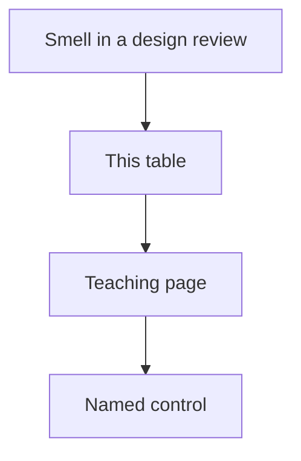

# Taught anti-patterns

Short catalog of failures **already taught**. Each row is a named smell, not a new domain.

| Anti-pattern | What goes wrong | Taught control | Open |
|---|---|---|---|
| **Agent-for-everything** | Agency risk (LLM03) on a known function | Function / workflow first | [10 when-not](../10-AGENTS/19-comparison.md) |
| **RAG without ACL** | Cross-tenant chunks (LLM09) | Filter **in** the retrieve query | [08 comparison](../08-RAG/19-comparison.md) |
| **Post-filter ACL** | Shared search already leaked geometry / neighbors | ACL on the chunk + query filter | [Arch A](../40-REFERENCE-ARCHITECTURES/A-enterprise-rag.md) |
| **Judge-as-truth** | Circular scores; ship on a helper | Gold first; judge audited | [18 simple](../18-EVALUATION/02-simple.md) |
| **Vibes-as-eval** | Three chats decide a release | Harness or no ship | [18 comparison](../18-EVALUATION/19-comparison.md) |
| **Model-as-guardrail** | Injection bypasses the “safe?” vote (LLM01/08) | Policy + deterministic filters | [22 comparison](../22-GUARDRAILS/19-comparison.md) |
| **MCP-for-three-functions** | Supply-chain surface for no reuse | In-process function calling | [13 comparison](../13-MCP/19-comparison.md) |
| **Always-one-tool agent** | A loop that always calls the same tool | It is a function | [10 when-not](../10-AGENTS/19-comparison.md) |
| **Agentic RAG before recall is measured** | More hops, more leak, same miss | Fix hybrid / chunk / ACL first | [09 when-not](../09-AGENTIC-RAG/19-comparison.md) |
| **NL-to-SQL without reject** | `SELECT *`, PII cols, no LIMIT | AST + allowlist before cursor | [15](../15-NL2SQL/01-overview.md) |
| **Multi-agent for one specialist** | Extra confused-deputy surface | One agent, three tools | [14](../14-MULTI-AGENT-SYSTEMS/01-overview.md) |
| **Secrets in the system prompt** | Hidden context is discoverable (LLM08) | Secret store + runtime authz | [22](../22-GUARDRAILS/01-overview.md) |
| **Grant union / god role** | Confused deputy at warehouse or tool | Caller identity, not max grants | [L7](../42-CAPSTONE-PROJECTS/L07.md) |
| **BREAK skipped** | ACL looks fine until a tenant swap | Run [break_acl](../43-EXPERIMENTS/01-overview.md) | [43](../43-EXPERIMENTS/01-overview.md) |

## What a principal would challenge

A slide that lists these anti-patterns with no evidence of tenant-scoped retrieve, tool IAM, or gold cases.

## What should I learn next?

[Design patterns](../46-DESIGN-PATTERNS/01-overview.md)
