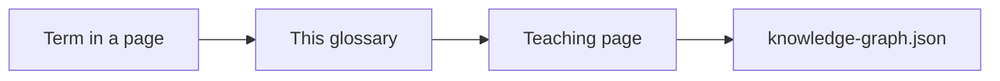

# Lab glossary

Durable definitions for terms **this lab actually uses**. Not a vendor dictionary. Links go to the page that teaches the term. Volatile SKU names stay out.

| Term | Durable meaning here | Open |
|---|---|---|
| Agent | Runtime that may **choose the next action** (usually a tool) under uncertainty | [10-AGENTS](../10-AGENTS/01-overview.md) |
| Workflow | Enumerated steps with explicit order — not a free loop | [When not an agent](../10-AGENTS/19-comparison.md) |
| LLM application | One (or few) model calls with a contract; no agency | [05](../05-LLM-APPLICATION-ENGINEERING/01-overview.md) |
| Structured output | Model must emit a schema the runtime can parse | [05](../05-LLM-APPLICATION-ENGINEERING/01-overview.md) |
| Token / context window | Discrete model input units; a hard length budget | [01-FOUNDATIONS](../01-FOUNDATIONS/01-overview.md) |
| Embedding | Vector that places text in a similarity space | [06](../06-EMBEDDINGS/01-overview.md) |
| Vector database | Store + search for those vectors; not an ACL system | [07](../07-VECTOR-DATABASES/01-overview.md) |
| Chunk | Index grain that retrieve returns; **must carry ACL** in production RAG | [08-RAG](../08-RAG/01-overview.md) |
| RAG | Retrieve evidence, then generate; generate cannot fix a wrong retrieve | [08-RAG](../08-RAG/01-overview.md) |
| Hybrid retrieve | Lexical + vector (and usually filters) | [08 comparison](../08-RAG/19-comparison.md) |
| Permission-aware RAG | Principal filter **in the retrieve query**, not after | [08 comparison](../08-RAG/19-comparison.md) |
| ACL-in-query | Same as above — grants travel with the chunk | [Arch A](../40-REFERENCE-ARCHITECTURES/A-enterprise-rag.md) |
| Agentic RAG | Retrieve is a **tool** the model may call again | [09](../09-AGENTIC-RAG/01-overview.md) |
| Retrieve-as-tool | The pattern name for that loop | [09](../09-AGENTIC-RAG/01-overview.md) |
| Tool / function calling | Model proposes name + args; **runtime** invokes after authz | [12](../12-TOOLS-FUNCTION-CALLING/01-overview.md) |
| Tool registry | Catalog of callable tools with identity, not a prompt list | [12](../12-TOOLS-FUNCTION-CALLING/01-overview.md) |
| MCP | Protocol: host creates a client per server; tools/resources/prompts | [13](../13-MCP/01-overview.md) |
| MCP host / client / server | Official roles (`SRC-MCP-ARCHITECTURE`) | [13 comparison](../13-MCP/19-comparison.md) |
| Orchestration | Coordination of steps or agents on **explicit** paths | [11](../11-AGENT-ORCHESTRATION/01-overview.md) |
| Multi-agent | Several loops plus a coordination rule | [14](../14-MULTI-AGENT-SYSTEMS/01-overview.md) |
| Supervisor / worker | One loop assigns work to specialists | [14](../14-MULTI-AGENT-SYSTEMS/01-overview.md) |
| Handoff | Transfer of the conversation or task to another agent | [14](../14-MULTI-AGENT-SYSTEMS/01-overview.md) |
| NL-to-SQL | Model proposes SQL; parse + policy before any cursor | [15](../15-NL2SQL/01-overview.md) |
| Ground truth / gold | Labeled cases you trust | [18](../18-EVALUATION/01-overview.md) |
| Eval harness | Automated run of gold (and helpers) that can fail a build | [18 logical](../18-EVALUATION/03-logical.md) |
| LLM-as-judge | Helper scorer — **must not replace** gold (`SRC-OPENAI-EVALS` is one registry, not required) | [18 simple](../18-EVALUATION/02-simple.md) |
| Guardrail | Policy + **deterministic** filters; a second model vote is not enough | [22](../22-GUARDRAILS/01-overview.md) |
| DLP / PII / PHI | Detect and block sensitive fields; LLM classifier is not enough | [23](../23-PHI-PII-DLP/01-overview.md) |
| Identity / authz | Who the tool runs as; prompt is not a grant | [26](../26-AI-CLOUD-ARCHITECTURE/01-overview.md) |
| HITL | Human confirmation of the **exact** action before irreversible writes | [22 comparison](../22-GUARDRAILS/19-comparison.md) |
| Prompt injection (LLM01:2026) | Hostile instructions in user, retrieve, or tool text | [21 map](../21-AI-SECURITY/03-logical.md) |
| Excessive agency (LLM03:2026) | Tools that can do more than the task needs | [12](../12-TOOLS-FUNCTION-CALLING/01-overview.md) |
| Hidden context (LLM08:2026) | Secrets or policy buried in a prompt that can leak | [22](../22-GUARDRAILS/01-overview.md) |
| Improper output handling (LLM10:2026) | Treating model text as safe code/SQL/HTML | [15](../15-NL2SQL/01-overview.md) |
| Confused deputy | Agent or tool acting with a stronger identity than the caller | [Arch E](../40-REFERENCE-ARCHITECTURES/E-multi-agent.md) |
| Why-chain | Baked JSON reasoning beside a page — not a live LLM | [why-chains](../why-chains.md) |
| Depth L1–L8 | Simple → Expert hide/show on the **same** concept | Gate 9 header control |
| Stage-gate factory | This lab’s Gates 0–10: author → QA PASS → next gate | [gate-plan](../99-META/gate-plan.md) |

## What should I remember?

If a word is not in this table, the lab has not claimed a durable definition for it.

## What should I learn next?

[Cheat-sheets](../50-CHEAT-SHEETS/01-overview.md)
