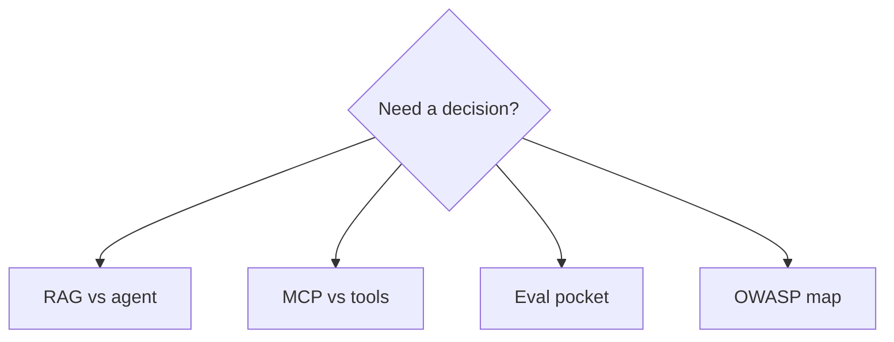

# High-value cheat-sheets

Four pocket tables. They **summarize** taught pages; they do not add new domains or invent metrics.

| Sheet | Use when |
|---|---|
| [RAG vs agent](rag-vs-agent.md) | Someone wants “an agent over the docs” |
| [MCP vs tools](mcp-vs-tools.md) | Someone wants MCP because it is fashionable |
| [Eval](eval.md) | Someone wants to ship on a few chats or a judge score |
| [OWASP Top 10 map](security-top10.md) | Someone wants a checklist without controls |

## What should I remember?

A cheat-sheet is a reminder. The comparison pages hold the argument.

## What should I learn next?

[Anti-patterns](../47-ANTI-PATTERNS/01-overview.md)
