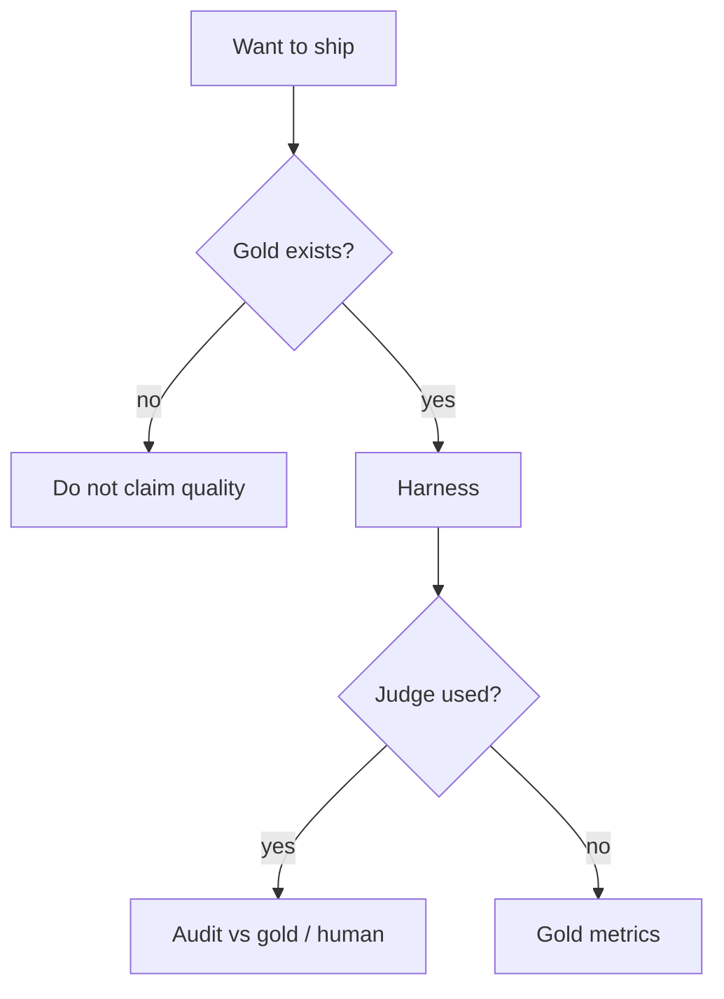

# Cheat-sheet — evaluation

NIST positions the AI RMF as helping organizations **evaluate** systems (`SRC-NIST-AI-RMF-LANDING`). A Slack thread is not that. Official `openai/evals` is one registry (`SRC-OPENAI-EVALS`); you do not need it to have a golden JSONL.

| Practice | Verdict | Page |
|---|---|---|
| A few chats, then ship | **Not eval** | [18 comparison](../18-EVALUATION/19-comparison.md) |
| Gold + fail-the-build | Minimum for a structured app | [18](../18-EVALUATION/01-overview.md) |
| Gold + retrieve@k + human sample | Minimum for RAG / agents | [18](../18-EVALUATION/01-overview.md) |
| Judge-only score as “accuracy” | Helper abused as truth | [02-simple](../18-EVALUATION/02-simple.md) |
| Same-family judge, no gold slice | Circular judging | [14-failure-modes](../18-EVALUATION/14-failure-modes.md) |
| Score up, holdout down | Gaming / leak | [14-failure-modes](../18-EVALUATION/14-failure-modes.md) |
| Unit tests only | Parsers pass; fluent wrong answers ship | [36](../36-AI-TESTING/01-overview.md) |
| Harness only | `DROP TABLE` can still pass a fluent judge | [15 hands-on](../15-NL2SQL/16-hands-on.md) |

## When not

Do not invent accuracy, p95, or dollar savings on these sheets. This lab has none.
