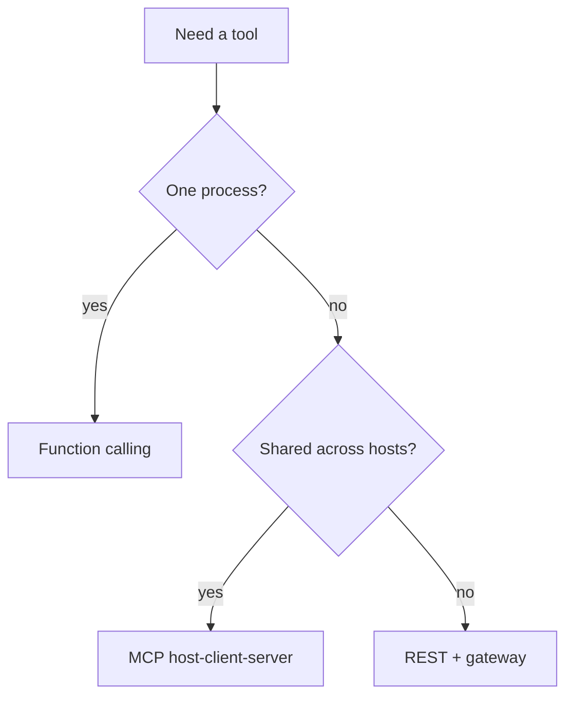

# Cheat-sheet — MCP vs tools

MCP standardizes **how a host talks to servers**. It does not replace IAM, and the protocol puts LLM usage **out of scope** (`SRC-MCP-ARCHITECTURE`).

| | Function calling | MCP | REST / your gateway |
|---|---|---|---|
| One app, few in-process functions | **Yes** | Overhead | Optional |
| Many hosts need the same catalog | Weak | **Designed for this** | You build it |
| Identity lives in | Your runtime | Still **your** policy | OAuth / IAM |
| What the model sees | Tool schema you register | Tools/resources/prompts the **host** exposes | Whatever you wrap |

## When not MCP

Three functions in one service — [12](../12-TOOLS-FUNCTION-CALLING/01-overview.md). MCP servers are supply chain (LLM04): pin and audit them ([13](../13-MCP/01-overview.md)).

OpenAI Agents SDK documents MCP **alongside** function tools (`SRC-OPENAI-AGENTS-SDK`). That is an integration, not “MCP instead of authz.”
